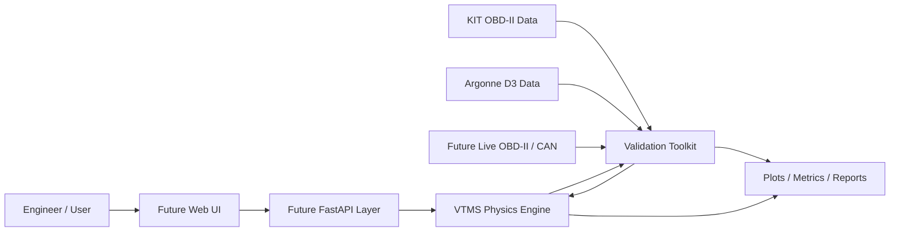
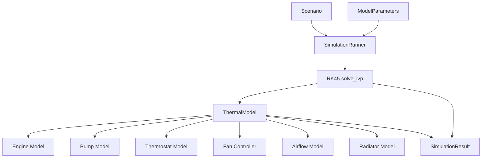
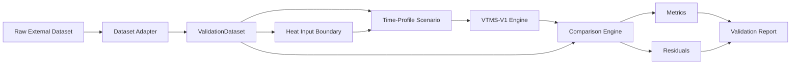
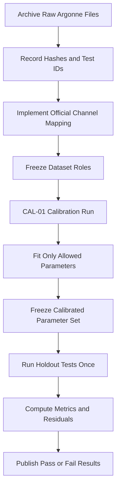
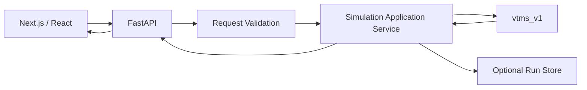
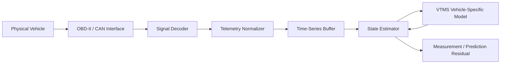
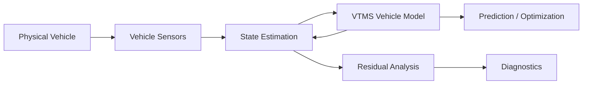

# VTMS Architecture

## Vehicle Thermal Management Simulation Platform

**Project:** VTMS  
**Current release:** VTMS-V1  
**Model version:** 1.0.0  
**Equation set:** EM-V1  
**Reference vehicle:** GRV-V1  
**Coolant property set:** EG50-CONST-V1  
**Parameter set:** GRV-V1-PARAMS-1  
**Current validation status:** `numerical_verified_generic_uncalibrated`  
**Current classification:** Physics-based lumped-parameter transient automotive thermal simulation  
**Digital twin status:** Not a digital twin in V1  
**Architecture status:** Current implementation baseline, August 2026

---

## 1. Purpose

VTMS is an engineering software platform for modeling, simulating, testing, and eventually synchronizing automotive thermal-management behavior.

The project begins with a deliberately constrained internal-combustion-engine cooling-system model. The immediate goal is not to reproduce every physical detail of a production vehicle. The goal is to provide a traceable, numerically verified, physics-based thermal simulation whose outputs can be tested against independent vehicle data.

VTMS is designed around a strict separation of concerns:

1. **Physics defines thermal behavior.**
2. **Numerical software solves the governing equations.**
3. **Validation software compares predictions with independent measurements.**
4. **Dataset adapters translate external telemetry into a common internal contract.**
5. **Future APIs and user interfaces consume the engineering engine without reimplementing physics.**
6. **Future AI features may interpret results, but they do not replace deterministic engineering calculations.**

This document describes the current architecture, the boundaries of VTMS-V1, the validation architecture already implemented, and the intended path from simulation platform to vehicle-specific digital-twin capability.

---

## 2. Project Naming

### 2.1 Permanent project name

**VTMS** stands for:

> **Vehicle Thermal Management Simulation Platform**

This is the repository-level and portfolio-level project name.

### 2.2 Current release name

The current engineering release is:

> **VTMS-V1: Vehicle Thermal Management Physics-Based Simulation Platform**

### 2.3 Future digital-twin terminology

The project should not currently be marketed as a digital twin. VTMS-V1 has no continuous synchronization with a specific physical vehicle and no vehicle-specific state-estimation loop.

The intended maturity progression is:

| Stage | Correct description |
|---|---|
| VTMS-V1 | Generic physics-based thermal simulation |
| VTMS-V2 | Vehicle-calibrated simulation with OBD/CAN replay |
| VTMS connected model | Physical vehicle data ingestion and synchronized state updates |
| VTMS digital twin | Vehicle-specific synchronized model with state estimation, calibration, prediction, and potentially bidirectional interaction |

The name **VTMS** remains valid across all stages, so the project does not need to be renamed when it matures.

---

## 3. Architectural Goals

VTMS architecture is optimized for the following priorities.

### 3.1 Engineering traceability

Every material output should be traceable to one of the following:

- a governing physical equation,
- a documented empirical relationship,
- a measured external input,
- a sourced property,
- a calibrated parameter,
- or an explicitly labeled assumption.

### 3.2 Separation of physics from presentation

The simulation core is the authoritative source of calculations. A future React or Next.js client must not reproduce thermal equations in the browser.

### 3.3 Verification before validation

Software correctness and physical accuracy are separate questions.

- **Verification:** Does the code correctly implement the frozen model?
- **Validation:** Does the frozen model reproduce independent physical behavior with acceptable error?

VTMS-V1 currently has strong numerical verification and only preliminary external plausibility evidence. Formal controlled validation is pending the Argonne D3 dataset.

### 3.4 Dataset independence

The validation engine consumes a normalized `ValidationDataset` contract rather than hard-coding any external data source.

### 3.5 Controlled model evolution

A failed validation result does not automatically authorize new physics or parameter changes. Model revisions must be explicit, versioned, justified, and reverified.

### 3.6 Honest uncertainty

Numerical precision must not be presented as physical accuracy. Generic calibration assumptions remain visible in result metadata.

---

## 4. Non-Goals of VTMS-V1

VTMS-V1 intentionally does **not** model:

- coolant pressure,
- boiling or two-phase flow,
- detailed coolant-jacket hydraulics,
- pump pressure curves or full hydraulic networks,
- engine-oil thermal behavior,
- heater-core heat extraction,
- cabin HVAC thermal loads,
- A/C condenser coupling,
- turbocharger thermal behavior,
- transmission cooling,
- local cylinder-head hot spots,
- underhood CFD,
- structural thermal stress,
- vehicle-specific OEM control strategies,
- production-vehicle calibration,
- live OBD-II communication,
- CAN-bus decoding,
- continuous state estimation,
- AI-generated physics,
- or closed-loop vehicle control.

These exclusions are architectural boundaries, not missing tasks that implementation agents should fill automatically.

---

## 5. System Context



The current repository implements the **physics engine** and **validation toolkit**. The UI, API, and live vehicle-data paths are future layers.

---

## 6. Current Repository Architecture

The current implementation is organized around two Python packages.

```text
src/
├── vtms_v1/
│   ├── airflow.py
│   ├── config.py
│   ├── constants.py
│   ├── coolant.py
│   ├── engine.py
│   ├── fan.py
│   ├── pump.py
│   ├── radiator.py
│   ├── scenario.py
│   ├── scenarios.py
│   ├── simulation.py
│   ├── thermal.py
│   ├── thermostat.py
│   ├── types.py
│   ├── utils.py
│   └── verification.py
│
└── vtms_validation/
    ├── dataset.py
    ├── heat_input.py
    ├── metrics.py
    ├── runner.py
    └── adapters/
        ├── argonne.py
        ├── kit.py
        └── normalized.py
```

Supporting repository areas include:

```text
tests/                  Core verification and regression tests
tests_validation/       Validation-toolkit tests
validation_data/        Reduced or normalized external comparison inputs
validation_outputs/     Metrics, residuals, plots, and reports
docs/                   Engineering specification and validation protocol
```

---

## 7. Core Simulation Architecture

### 7.1 Architectural boundary

`vtms_v1` contains all VTMS-V1 deterministic physics and numerical integration logic.

It must remain usable without:

- FastAPI,
- React,
- external datasets,
- AI services,
- a database,
- or a network connection.

This makes the engineering model independently testable.

### 7.2 Core execution flow



`SimulationRunner` owns integration and result construction. `ThermalModel` owns the instantaneous thermal equations and delegates component behavior to focused domain modules.

---

## 8. Frozen VTMS-V1 State Model

### 8.1 State vector

VTMS-V1 contains exactly two differential thermal states:

\[
\mathbf{x}(t) =
\begin{bmatrix}
T_e(t) \\
T_c(t)
\end{bmatrix}
\]

where:

- \(T_e\) is effective engine-structure temperature,
- \(T_c\) is bulk engine-side coolant temperature and radiator-inlet temperature.

### 8.2 Radiator outlet temperature

Radiator outlet temperature is **not** a third differential state. It is calculated algebraically from the radiator heat-transfer solution.

This design prevents VTMS-V1 from introducing an unsupported radiator thermal storage state and keeps the energy balance consistent with Engineering Model Specification 1.0.0.

### 8.3 Governing ODEs

Engine thermal balance:

\[
C_e\frac{dT_e}{dt}
=
\dot Q_{engine}
-
\dot Q_{ec}
-
\dot Q_{ea}
\]

Coolant thermal balance:

\[
C_c\frac{dT_c}{dt}
=
\dot Q_{ec}
-
\dot Q_{rad}
\]

Engine-to-coolant transfer:

\[
\dot Q_{ec}=UA_{ec}(T_e-T_c)
\]

Engine-to-ambient transfer:

\[
\dot Q_{ea}=UA_{ea}(T_e-T_a)
\]

The radiator model supplies \(\dot Q_{rad}\).

---

## 9. Component Architecture

### 9.1 `ReferenceEngineModel`

Responsibilities:

- provide the generic reference torque-shape curve,
- convert RPM and effective load to brake power,
- estimate brake efficiency,
- estimate fuel power,
- convert fuel power to engine heat using the wall-heat fraction,
- accept a direct `engine_heat_override_w` boundary when external evidence provides a stronger heat-input estimate.

The direct heat override is strategically important. It allows physical-validation datasets to bypass the generic RPM/load heat adapter without rewriting the thermal core.

### 9.2 `PumpModel`

Responsibilities:

- calculate empirical coolant mass flow from engine RPM,
- cap flow at the configured maximum,
- apply a dimensionless pump-health factor,
- return zero flow when engine speed is zero.

V1 does not solve pump pressure or system resistance.

### 9.3 `ThermostatModel`

Responsibilities:

- calculate a continuous opening fraction from coolant temperature,
- support normal, stuck-open, and stuck-closed modes,
- apply thermostat-health restriction,
- split total pump flow into radiator and bypass flow.

### 9.4 `FanController`

Responsibilities:

- calculate normalized fan command from coolant temperature,
- provide continuous fan modulation from `fan_start_c` to `fan_full_c`,
- force zero fan command during fan-failure scenarios.

### 9.5 `AirflowModel`

Responsibilities:

- compute air density from ambient temperature and standard atmospheric pressure,
- estimate ram-air volume flow from vehicle speed, radiator area, and capture coefficient,
- estimate fan volume flow,
- combine fan and ram airflow with the V1 root-sum-square approximation,
- apply airflow-health restriction,
- convert volume flow to air mass flow.

The root-sum-square combination is a V1 approximation, not a universal fan plus ram-air law.

### 9.6 `RadiatorModel`

Responsibilities:

- calculate coolant and air heat-capacity rates,
- detect zero-flow conditions,
- calculate \(C_{min}\), \(C_{max}\), and capacity ratio,
- calculate effective radiator \(UA\),
- calculate NTU,
- calculate both-fluids-unmixed crossflow effectiveness,
- calculate radiator heat rejection,
- calculate algebraic radiator outlet temperature.

The crossflow correlation currently implemented is:

\[
\varepsilon
=
1-
\exp\left[
\frac{NTU^{0.22}}{C_r}
\left(
\exp(-C_rNTU^{0.78})-1
\right)
\right]
\]

with explicit special handling as the capacity ratio approaches zero.

### 9.7 `ThermalModel`

`ThermalModel` is the composition root for the component models. It owns the V1 energy-balance equations and returns the derivative pair:

```text
dT_engine / dt
dT_coolant / dt
```

It also exposes component-level evaluation for result post-processing.

---

## 10. Scenario Architecture

`Scenario` defines time-varying boundary conditions without changing the thermal equations.

A scenario contains:

- scenario identifier,
- name,
- duration,
- ambient-temperature profile,
- engine-speed profile,
- effective-load profile,
- vehicle-speed profile,
- initial engine temperature,
- initial coolant temperature,
- optional direct engine-heat profile,
- fault state,
- output sampling interval.

Each operating input can be either:

- a scalar constant,
- or a callable time profile.

This is the mechanism used both for synthetic engineering scenarios and external telemetry replay.

### 10.1 Canonical scenarios

The repository contains the frozen V1 canonical scenario family S-01 through S-09. These are used for regression and directional fault testing, not physical validation.

### 10.2 Fault representation

`FaultState` currently supports:

- fan failure,
- thermostat mode,
- thermostat health,
- pump health,
- radiator health,
- airflow health.

Health multipliers are dimensionless values in `[0, 1]`.

---

## 11. Numerical Solver Architecture

### 11.1 Solver

VTMS-V1 integrates the ODE system using SciPy `solve_ivp` with RK45.

The frozen generic parameters specify:

```text
solver_rtol      = 1e-6
solver_atol      = 1e-8
solver_max_step  = 1.0 s
```

### 11.2 Output sampling

The solver may use its own internal adaptive time steps. `SimulationRunner` samples the solution at the scenario-defined output interval for engineering results.

### 11.3 Why the solver is isolated

The ODE equations do not depend on RK45-specific implementation details. A future specification could evaluate a different numerical solver without rewriting individual component models.

---

## 12. Simulation Result Contract

Every completed run produces a `SimulationResult` containing:

```text
SimulationResult
├── model_metadata
├── scenario_metadata
├── parameter_snapshot
├── provenance_snapshot
├── time_series
├── events
├── energy_balance
├── warnings
└── solver_diagnostics
```

### 12.1 Time-series values

Each `TimeSeriesPoint` records:

- simulation time,
- engine-structure temperature,
- coolant temperature,
- radiator-outlet temperature,
- engine heat input,
- engine-to-coolant heat transfer,
- engine-to-ambient heat transfer,
- radiator heat rejection,
- pump mass flow,
- radiator coolant flow,
- bypass flow,
- radiator air mass flow,
- thermostat opening fraction,
- fan command fraction,
- radiator effectiveness,
- radiator NTU.

### 12.2 Result provenance

Every result includes a parameter snapshot and parameter-provenance snapshot. Parameter classes include:

- `SOURCED`,
- `DERIVED`,
- `CALIBRATED`,
- `ASSUMED`,
- `STANDARD`,
- `SPECIFICATION`.

This is an architectural requirement. A result must be reproducible from its model ID, equation-set ID, parameter set, scenario, and parameters.

---

## 13. Energy-Conservation Architecture

Energy accounting is a first-class result, not an offline debugging step.

For the full simulation interval:

\[
E_{in}=\int \dot Q_{engine}\,dt
\]

\[
E_{out}=\int (\dot Q_{ea}+\dot Q_{rad})\,dt
\]

Stored-energy change is:

\[
\Delta U
=
C_e\Delta T_e+C_c\Delta T_c
\]

Residual:

\[
R_E=E_{in}-E_{out}-\Delta U
\]

Normalized residual:

\[
\epsilon_E=
\frac{|R_E|}{\max(|E_{in}|,1)}
\]

The conservation result is included with every `SimulationResult` so numerical integrity can be monitored across scenarios, validation runs, and future APIs.

---

## 14. Model-Domain Warnings

VTMS-V1 is a liquid-only thermal model. It does not model pressure or phase change.

The implementation contains:

```text
LIQUID_MODEL_CAUTION_C = 120.0
```

This is only a software warning boundary. It is **not**:

- a coolant boiling point,
- an engine-damage threshold,
- an OEM specification,
- or a pressure-cap limit.

Crossing this boundary creates an event and warning but does not clip or modify the state equations.

A later pressure-aware specification should replace this fixed caution mechanism with a physically defined thermodynamic domain.

---

## 15. Verification Architecture

### 15.1 Verification purpose

Verification establishes that the software behaves consistently with the frozen V1 specification.

The test suite covers:

- component invariants,
- thermostat bounds,
- fan bounds,
- nonnegative mass flows,
- crossflow effectiveness bounds,
- zero-flow radiator behavior,
- energy conservation,
- solver convergence,
- fault-direction behavior,
- warning behavior,
- model metadata,
- parameter provenance,
- canonical scenario regression.

### 15.2 Current status

The combined core and validation-toolkit test suite currently has **22 passing automated tests**.

This does not establish production-vehicle accuracy.

---

## 16. Validation Architecture

The validation layer is a separate package:

```text
vtms_validation
```

Its purpose is to connect independent physical evidence to the unchanged physics engine.



---

## 17. `ValidationDataset` Contract

External evidence is normalized into one dataset-independent object.

Required fields:

```text
dataset_id
source_name
time_s
measured_coolant_temp_c
engine_speed_rpm
vehicle_speed_m_s
ambient_temp_c
```

Optional fields currently include:

```text
mass_air_flow_g_s
fuel_rate_kg_s
metadata
```

The contract enforces:

- at least two samples,
- equal array lengths,
- finite values,
- strictly increasing time,
- time beginning at zero,
- nonnegative vehicle speed,
- VTMS engine-speed domain checks,
- nonnegative optional mass-flow channels.

This abstraction prevents source-specific data structures from leaking into the physics package.

---

## 18. Evidence Hierarchy

VTMS distinguishes four evidence classes.

### 18.1 Numerical verification

Source:

- synthetic canonical scenarios,
- unit tests,
- conservation tests,
- convergence tests.

Claim supported:

> The software implements the frozen model consistently.

### 18.2 External plausibility evidence

Current source:

- KIT Automotive OBD-II Dataset.

Claim supported:

> The model can be driven by independent real-world telemetry and compared with measured coolant behavior.

Claim **not** supported:

> VTMS has been formally calibrated and validated for the KIT vehicle.

### 18.3 Calibration evidence

Planned primary source:

- one controlled Argonne D3 dynamometer run designated `CAL-01`.

Claim supported after completion:

> The permitted uncertain parameters were fitted using a documented controlled dataset.

### 18.4 Blind holdout validation

Planned source:

- separate Argonne D3 runs whose coolant-temperature histories are not used for parameter fitting.

Claim supported after completion:

> The calibrated model was evaluated against independent controlled holdout conditions.

These labels must remain distinct in code, documentation, UI, and portfolio claims.

---

## 19. KIT Adapter Architecture

`load_kit_csv` translates KIT OBD-II CSV data into `ValidationDataset`.

The KIT files are asynchronous OBD logs. Individual PIDs are not guaranteed to update on every source row.

The adapter therefore:

1. parses source timestamps,
2. maintains source ordering,
3. handles midnight rollover,
4. parses required signals,
5. forward-fills each PID only after its first valid observation,
6. converts vehicle speed from km/h to m/s,
7. creates normalized elapsed time beginning at zero,
8. records source DOI and license metadata.

Required KIT fields for the current adapter are:

- time,
- engine coolant temperature,
- engine RPM,
- vehicle speed,
- ambient air temperature,
- mass airflow.

---

## 20. KIT Heat-Input Proxy

KIT does not provide the controlled fuel-flow evidence preferred for formal VTMS calibration. The validation toolkit therefore includes `MafStoichiometricHeatEstimator` only for secondary plausibility work.

The estimator derives an approximate fuel rate from MAF:

\[
\dot m_f
\approx
\frac{\dot m_{air}}{AFR_{stoich}}
\]

and then estimates engine thermal input:

\[
\dot Q_{engine}
=
\dot m_f \cdot LHV \cdot f_{wall}
\]

Current assumptions include:

```text
stoichiometric AFR = 14.7
representative gasoline LHV = 43.7 MJ/kg
wall heat fraction = current VTMS parameter
```

The estimator metadata explicitly labels fuel rate as:

```text
derived_not_measured
```

and evidence level as:

```text
secondary_plausibility_only
```

This derived signal must never be described as measured fuel consumption.

---

## 21. First External Plausibility Finding

VTMS-V1 has been run without parameter modification against an independent real-world KIT Seat Leon warm-up trace.

The coarse comparison showed:

- final predicted operating temperature close to the measured final region,
- but transient warm-up substantially too fast,
- large positive residuals through much of the warm-up period,
- early 60°C, 80°C, and 90°C threshold crossings.

The comparison produced approximately:

| Metric | Coarse KIT result |
|---|---:|
| RMSE | 21.40°C |
| MAE | 16.50°C |
| Mean bias | +16.13°C |
| Maximum absolute error | 40.46°C |
| Final error | -0.79°C |
| 60°C arrival error | -276 s |
| 80°C arrival error | -496 s |
| 90°C arrival error | -273 s |

This is an **external plausibility finding**, not formal validation.

The model was deliberately not tuned in response.

Possible contributors include:

- uncertainty in the MAF-derived heat-input proxy,
- generic engine thermal capacitance,
- generic wall-heat fraction,
- initial effective engine-temperature assumptions,
- omitted oil thermal mass,
- omitted heater-core extraction,
- omitted vehicle-specific control behavior,
- vehicle-specific parameter differences,
- coarse comparison sampling.

The architecture preserves this mismatch because it is useful engineering evidence.

---

## 22. Argonne D3 Adapter Architecture

`ArgonneD3Adapter` currently exists as a deliberate contract placeholder.

It defines required logical signals but raises `NotImplementedError` rather than guessing channel names or units.

Required logical channels:

```text
time_s
engine_coolant_temp_c
engine_speed_rpm
vehicle_speed_m_s
ambient_temp_c
```

Preferred heat-input evidence:

```text
fuel_rate_kg_s
fuel_energy_rate_w
engine_torque_nm
```

The adapter will only be implemented after the Argonne raw files and official signal dictionary are available.

This is an intentional architectural safeguard against silent schema invention.

---

## 23. Planned Calibration and Blind-Validation Flow

Formal physical validation will follow a preregistered process.



The preferred controlled test hierarchy is:

1. 72°F cold-start UDDS for calibration,
2. separate 72°F cold-start replicate for strongest blind warm-up validation if available,
3. 72°F hot-start UDDS,
4. 72°F HWFET,
5. 72°F US06.

Extreme-temperature cycles with active cabin climate control are challenge cases until VTMS includes HVAC thermal loads.

---

## 24. Calibration Boundary

The calibration process must not become unrestricted curve fitting.

The preregistered initial calibration set is limited to a small number of uncertain thermal parameters, principally:

- wall heat fraction,
- engine thermal capacitance,
- engine-to-coolant effective conductance,
- radiator nominal conductance.

Additional parameters may only be released for calibration after a documented model-identifiability or residual-analysis justification.

After calibration, the resulting parameter set must receive a new version identifier and remain immutable during blind holdout execution.

---

## 25. Validation Metrics

The validation toolkit currently computes:

- root mean square error,
- mean absolute error,
- mean bias,
- maximum absolute error,
- 90th-percentile absolute error,
- final temperature error,
- measured final temperature,
- predicted final temperature,
- 60°C arrival-time error,
- 80°C arrival-time error,
- 90°C arrival-time error.

Residual sign is defined as:

\[
e(t)=T_{predicted}(t)-T_{measured}(t)
\]

Positive residual means VTMS is hotter than the measured coolant signal.

Future validation may also add:

- warm-up slope error,
- thermostat transition timing,
- steady-state segment error,
- cycle-specific weighted metrics,
- parameter confidence intervals,
- residual autocorrelation analysis.

---

## 26. Future API Architecture

FastAPI is intentionally deferred until the engineering engine and validation process are stable.

The intended boundary is:



### 26.1 API responsibilities

Future FastAPI code may:

- validate user requests,
- select reference parameter sets,
- construct `Scenario` objects,
- invoke the core runner,
- serialize `SimulationResult`,
- retrieve stored runs,
- expose validation metadata.

It may **not** independently calculate thermal physics.

---

## 27. Future Frontend Architecture

The planned frontend is React or Next.js with TypeScript.

Primary UI responsibilities:

- scenario configuration,
- vehicle and environment controls,
- engineering charts,
- thermal-flow visualization,
- fault injection,
- result comparisons,
- validation-status disclosure,
- assumptions and provenance inspection,
- SI and US-customary display conversion.

The browser should receive already-calculated engineering values from the backend.

Suggested primary views:

```text
Overview
Simulation
Thermal System
Scenario Builder
Fault Analysis
Validation
Model Assumptions
Engineering Parameters
Documentation
```

The validation view should visibly distinguish numerical verification, external plausibility, calibration, and blind validation.

---

## 28. Future Persistence Layer

VTMS-V1 does not require a database.

A persistence layer becomes useful when the application begins storing:

- simulation runs,
- parameter-set versions,
- calibration records,
- external dataset metadata,
- validation metrics,
- user-defined scenarios,
- physical vehicle identities,
- OBD/CAN sessions,
- model-version provenance.

A future schema should treat parameter sets and model versions as immutable engineering records rather than mutable preference objects.

---

## 29. Future OBD-II and CAN Architecture

The transition from offline simulation to connected vehicle modeling should introduce a dedicated telemetry layer.



Standard OBD-II signals can provide useful observable inputs, but some thermal states and control commands will remain unmeasured or manufacturer-specific.

Likely measured signals include:

- coolant temperature,
- RPM,
- vehicle speed,
- intake-air temperature,
- calculated load,
- throttle position,
- MAF.

Likely estimated or manufacturer-specific states include:

- coolant mass flow,
- thermostat opening,
- radiator inlet and outlet temperatures,
- fan PWM command,
- radiator airflow,
- effective radiator conductance.

---

## 30. Digital-Twin Maturity Architecture

A true VTMS digital twin requires more than adding live charts.

The architecture must eventually support:

1. identity of a specific physical vehicle,
2. synchronized telemetry ingestion,
3. timestamp alignment,
4. vehicle-specific parameter sets,
5. unmeasured-state estimation,
6. continuous prediction-versus-measurement residuals,
7. parameter or state reconciliation,
8. uncertainty characterization,
9. health or fault-state estimation,
10. model-version and telemetry provenance.

A future digital-twin loop may resemble:



Until this synchronization exists, VTMS should retain the term **simulation platform**.

---

## 31. AI Architecture Principles

AI is a future interpretation layer, not a physics layer.

Appropriate future AI responsibilities:

- explain simulation trends,
- summarize validation residuals,
- rank diagnostic hypotheses,
- convert user goals into deterministic scenario configurations,
- interpret parameter sensitivity,
- retrieve model documentation,
- explain assumptions and limitations.

Inappropriate AI responsibilities:

- calculate heat-transfer equations instead of the numerical engine,
- invent missing physical constants,
- override solver output without a deterministic rule,
- silently change calibrated parameters,
- declare mechanical failure from generic unvalidated simulations.

The safe future pattern is:

```text
User question
    ↓
AI interpretation
    ↓
Structured deterministic request
    ↓
VTMS physics / validation engine
    ↓
Verified numerical result
    ↓
AI explanation
```

---

## 32. Versioning and Provenance

VTMS uses explicit model identity fields.

Current values are:

```text
MODEL_ID             = VTMS-V1
MODEL_VERSION        = 1.0.0
EQUATION_SET         = EM-V1
REFERENCE_VEHICLE    = GRV-V1
COOLANT_PROPERTY_SET = EG50-CONST-V1
PARAMETER_SET        = GRV-V1-PARAMS-1
VALIDATION_STATUS    = numerical_verified_generic_uncalibrated
```

### 32.1 Versioning rules

A new model version is required when:

- governing equations change,
- a new differential state is introduced,
- radiator correlation changes,
- pump architecture changes materially,
- phase-change or pressure physics are introduced,
- component topology changes.

A new parameter-set version is sufficient when:

- only parameter values change,
- a generic model is calibrated to a specific vehicle without changing equations.

A new dataset-adapter version is required when:

- channel mapping changes,
- unit interpretation changes,
- synchronization logic changes.

---

## 33. Error Handling and Numerical Safeguards

The architecture currently protects against several invalid conditions.

Examples include:

- temperatures below absolute zero,
- negative vehicle speed,
- invalid health multipliers,
- invalid thermostat ranges,
- invalid fan-control ranges,
- negative coolant or air mass flow,
- engine RPM outside the reference-map domain,
- zero radiator coolant flow,
- zero radiator air flow,
- invalid crossflow capacity ratios,
- divide-by-zero conditions in the heat exchanger.

Invalid engineering input should fail loudly rather than silently coercing values into a plausible-looking output.

---

## 34. Security and Safety Boundary

VTMS-V1 is offline analytical software and has no direct vehicle-control capability.

Future connected architecture must maintain a strong separation between:

- passive telemetry reading,
- diagnostic interpretation,
- and any future ability to issue commands.

Live CAN write capability should not be introduced merely to make the project qualify as a digital twin. Any bidirectional vehicle-control work would require a separate safety architecture, command allowlist, authentication model, hardware protections, and test environment.

---

## 35. Architecture Decision Summary

| Decision | VTMS-V1 choice | Reason |
|---|---|---|
| Project name | VTMS | Stable across simulation and digital-twin maturity |
| V1 classification | Physics-based simulation | Accurate description of current capability |
| Thermal states | Two | Minimum transient model without unsupported radiator storage |
| Radiator outlet | Algebraic | Avoids double-counting thermal storage |
| Solver | RK45 via `solve_ivp` | Stable, adaptive, transparent numerical integration |
| Radiator | Crossflow effectiveness-NTU | Appropriate when outlet temperatures are unknown |
| Pump | Empirical RPM-linked | Avoids inventing unavailable pressure-network data |
| Thermostat | Continuous fraction | Avoids unrealistic instantaneous switching |
| Airflow | Ram plus fan approximation | Supports idle and road-speed cooling without CFD |
| Internal units | SI | Prevents mixed-unit calculation errors |
| Physics location | Python core only | Keeps frontend and API from becoming competing calculation engines |
| Validation abstraction | `ValidationDataset` | Keeps external datasets decoupled from core physics |
| KIT role | External plausibility | Real data but insufficient controlled heat-input evidence |
| Argonne role | Planned controlled calibration and holdout validation | Stronger experimental conditions and evidence quality |
| Argonne adapter | Placeholder until signal dictionary arrives | Prevents invented channel mappings |
| AI | Future interpretation layer | Deterministic physics remains authoritative |
| Digital twin | Future maturity target | Requires vehicle-specific synchronization and state estimation |

---

## 36. Known Architectural Gaps

The most important unresolved engineering gaps are:

### 36.1 Transient warm-up fidelity

The first external KIT comparison indicates that generic VTMS-V1 warm-up is too rapid. Controlled data is required before deciding whether this requires parameter calibration or model-topology changes.

### 36.2 Heat-input observability

The generic RPM/load heat model and KIT MAF proxy are weaker than direct dynamometer fuel-rate or fuel-energy measurements.

### 36.3 Effective engine thermal mass

A single effective engine-structure capacitance may be insufficient to reproduce all warm-up regimes.

### 36.4 Omitted oil circuit

Oil thermal mass can affect cold-start transient behavior and may become the highest-value candidate for a future state-model extension.

### 36.5 Omitted heater core and HVAC

These exclusions constrain the validity of cold-weather and climate-control-on comparisons.

### 36.6 Generic radiator and airflow parameters

Radiator \(UA\), ram-air capture, fan flow, and coolant-flow parameters remain generic until controlled calibration is available.

### 36.7 Sensor observability mismatch

Measured engine coolant temperature is a sensor-location measurement, while VTMS \(T_c\) is a lumped bulk coolant state. The difference must be considered during physical validation.

---

## 37. Near-Term Development Sequence

The architecture intentionally constrains the next work order.

### Phase A: Complete controlled physical validation

1. obtain Argonne D3 raw files and signal dictionary,
2. implement `ArgonneD3Adapter`,
3. freeze calibration and holdout test IDs,
4. calibrate only preregistered parameters,
5. freeze the calibrated parameter set,
6. execute blind holdouts,
7. publish residuals and metrics regardless of outcome.

### Phase B: Model review

If blind validation reveals systematic error:

1. diagnose residual structure,
2. determine whether error is parameter or topology driven,
3. justify any V1.1 or V2 state-model change,
4. update the engineering specification,
5. rerun verification,
6. repeat validation with proper dataset separation.

### Phase C: API

Only after the engineering model reaches an acceptable validation milestone:

1. define request and response schemas,
2. create FastAPI application services,
3. expose scenario execution,
4. expose model metadata and validation status,
5. preserve `SimulationResult` as the authoritative backend output.

### Phase D: Web interface

Build the user-facing simulation and engineering visualization experience after the API contract is stable.

---

## 38. Architectural Invariants

The following rules should be treated as non-negotiable unless this document and the engineering specification are intentionally revised.

1. The frontend does not calculate governing thermal physics.
2. Validation adapters do not change the physics engine.
3. External datasets are normalized before entering simulation logic.
4. Calibration and validation datasets remain distinct.
5. A holdout dataset is not reused for tuning after results are observed.
6. Every result carries model and parameter provenance.
7. Numerical verification is not described as physical validation.
8. External plausibility is not described as formal validation.
9. Generic VTMS-V1 is not described as an OEM-calibrated production-vehicle model.
10. VTMS-V1 is not described as a synchronized digital twin.
11. AI does not replace deterministic engineering calculations.
12. New physical states require a specification and model-version change.
13. Failed validation results are preserved and investigated rather than hidden through unconstrained fitting.
14. Unknown external data schemas are not guessed.

---

## 39. Portfolio Positioning

The architecture should be described professionally as:

> VTMS is a physics-based automotive thermal-management simulation platform built around transient lumped-parameter energy balances, component-level cooling-system models, RK45 numerical integration, engineering provenance, automated numerical verification, and an independent validation pipeline. VTMS-V1 currently models a generic liquid-cooled gasoline vehicle and is being evaluated against external OBD-II telemetry while controlled dynamometer calibration and blind holdout validation are prepared using Argonne vehicle data. The architecture is intentionally structured for future OBD/CAN synchronization, state estimation, vehicle-specific calibration, and eventual digital-twin functionality.

This wording accurately communicates the project's engineering depth without overstating physical validation or digital-twin maturity.

---

## 40. Related Engineering Documents

The current repository should keep the following documents together:

```text
ARCHITECTURE.md
README.md
IMPLEMENTATION_AUDIT.md
VERIFICATION_RESULTS.md
KIT_DATASET_AUDIT.md
VALIDATION_TOOLKIT_README.md
docs/
├── VTMS_V1_Engineering_Model_Specification.docx
└── VTMS_V1_Physical_Validation_Protocol.docx
```

Document roles:

| Document | Purpose |
|---|---|
| `ARCHITECTURE.md` | System boundaries, components, data flow, evidence architecture, future evolution |
| `README.md` | Repository orientation and execution overview |
| Engineering Model Specification | Authoritative V1 physics contract |
| Physical Validation Protocol | Preregistered controlled-validation procedure |
| `IMPLEMENTATION_AUDIT.md` | Records implementation decisions and specification gaps |
| `VERIFICATION_RESULTS.md` | Records numerical verification results |
| `KIT_DATASET_AUDIT.md` | Records external KIT evidence quality and limitations |
| `VALIDATION_TOOLKIT_README.md` | Explains validation package operation |

---

## 41. Definition of Done for VTMS-V1

VTMS-V1 should not be considered fully complete based only on software implementation.

The V1 engineering milestone is complete when:

- the frozen equation set remains numerically verified,
- controlled calibration data has been qualified,
- the permitted parameter subset has been calibrated once,
- at least one independent holdout dataset has been executed without retuning,
- validation metrics and residuals are published,
- validation limitations are documented,
- model status is updated accurately based on evidence.

If the holdout fails, VTMS-V1 can still be a successful engineering project. The correct outcome is then a documented model-deficiency analysis and a justified next model revision.

---

## 42. Final Architecture Statement

VTMS is intentionally built from the physics outward.

The current architecture establishes a deterministic thermal core, a reproducible scenario system, transparent parameter provenance, numerical verification, dataset-independent physical-evidence ingestion, and explicit separation between plausibility, calibration, and blind validation.

The next architectural milestone is not a more elaborate interface. It is completion of controlled physical validation.

Once the model has earned stronger physical credibility, FastAPI, Next.js, live OBD/CAN ingestion, state estimation, optimization, and AI-assisted engineering interpretation can be added around the existing core without redefining what the underlying physics mean.
