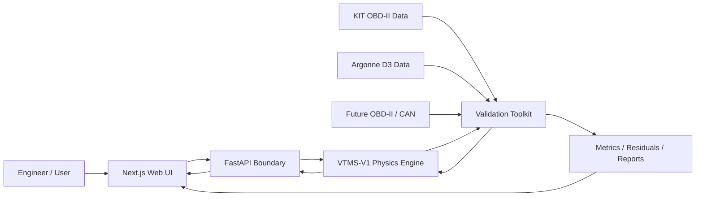

# VTMS

## Vehicle Thermal Management Simulation Platform

**VTMS-V1** is a physics-based automotive thermal-management simulation platform built around a deterministic Python/SciPy engineering model, numerical verification, external validation tooling, a FastAPI execution boundary, and a responsive Next.js engineering interface.

The project is intentionally **engineering first**. Presentation, API transport, and future AI capabilities remain above the physics layer rather than replacing it.

> **Current classification:** Generic physics-based lumped-parameter transient thermal simulation. VTMS-V1 is not an OEM-calibrated vehicle model and is not yet a synchronized digital twin.

## Why this project exists

VTMS explores the intersection of mechanical engineering, automotive systems, scientific computing, validation, and software engineering. Calculated quantities must come from governing equations, sourced properties, measured inputs, calibrated parameters, or explicitly identified assumptions.

The project is built around three questions:

1. Can the frozen thermal model be implemented consistently and conserve energy numerically?
2. Can predictions be compared against independent real-world telemetry without contaminating the model through premature tuning?
3. Can a modern web application expose the engineering model without moving thermal calculations into the browser or overstating model maturity?

## Current status

| Area | Status |
|---|---|
| Physics specification | Complete, VTMS-V1 Engineering Model Specification 1.0.0 |
| Standalone Python engine | Complete |
| Numerical integration | SciPy `solve_ivp`, RK45 |
| Automated Python/API tests | **29 passing** |
| Engineering verification checks | **21 passing** |
| Canonical scenario suite | S-01 through S-09 implemented |
| Energy-conservation verification | Passing |
| External real-world plausibility test | Complete using KIT OBD-II telemetry |
| Controlled physical validation | Pending Argonne D3 raw data |
| UI/UX foundation | Complete |
| UI-1 Next.js application shell | Complete |
| UI-2 FastAPI simulation boundary | Complete |
| Custom and fault Simulation Lab execution | Complete |
| Web lint / typecheck / production build | Enforced in GitHub Actions |
| Public application deployment | Pending |
| Vehicle-specific digital twin | Future maturity target |

## Architecture



The browser never calculates VTMS thermal physics. Simulation Lab sends a scenario request to FastAPI. The API validates and translates the public request into the existing Python `Scenario` contract, invokes `SimulationRunner`, and returns the authoritative serialized `SimulationResult`.

Computed runs are currently stored only in browser session storage. A returned run is immutable and rendered through `/results/[runId]`. No database is required for UI-2.

For the complete engineering and software map, see [`ARCHITECTURE.md`](ARCHITECTURE.md).

## VTMS-V1 thermal model

VTMS-V1 uses two transient state temperatures:

- `T_e`: effective engine-structure temperature
- `T_c`: bulk engine-side coolant temperature

Radiator outlet temperature is derived algebraically rather than integrated as a third state.

The core balances are:

```text
C_e dT_e/dt = Q_engine - Q_ec - Q_ea
C_c dT_c/dt = Q_ec - Q_rad
```

with:

```text
Q_ec = UA_ec (T_e - T_c)
Q_ea = UA_ea (T_e - T_a)
```

Radiator heat rejection uses a crossflow effectiveness-NTU formulation. Pump flow, thermostat and bypass behavior, fan airflow, ram airflow, radiator degradation, pump degradation, airflow degradation, and supported faults are deterministic component models.

## Repository layout

```text
.
├── README.md
├── ARCHITECTURE.md
├── IMPLEMENTATION_AUDIT.md
├── VERIFICATION_RESULTS.md
├── KIT_DATASET_AUDIT.md
├── VALIDATION_TOOLKIT_README.md
├── pyproject.toml
├── docs/
│   ├── UI_UX_PRODUCT_SPEC.md
│   ├── INFORMATION_ARCHITECTURE.md
│   ├── LOW_FIDELITY_WIREFRAMES.md
│   ├── VTMS_V1_Engineering_Model_Specification.docx
│   ├── VTMS_V1_Physical_Validation_Protocol.docx
│   └── images/
├── src/
│   ├── vtms_v1/
│   ├── vtms_validation/
│   └── vtms_api/
├── tests/
├── tests_validation/
├── tests_api/
├── validation_data/
├── validation_outputs/
└── web/
    ├── app/
    ├── components/
    ├── lib/
    ├── public/
    └── package.json
```

## UI-2 simulation workflow

```text
Simulation Lab
      ↓
UI-facing scenario request
      ↓
POST /api/v1/simulations
      ↓
FastAPI validation + unit translation
      ↓
Python Scenario
      ↓
SimulationRunner
      ↓
Authoritative SimulationResult
      ↓
Browser session storage
      ↓
/results/[runId]
      ↓
Synchronized charts + thermal-system playback
```

### Canonical scenario integrity

S-01 through S-09 are frozen engineering cases. The API protects those identities.

If a request uses a canonical scenario ID but changes a physical input or fault state, the API rejects it. The UI labels edited presets with a `CUSTOM-` scenario ID instead. This prevents modified runs from being mistaken for the frozen regression scenarios.

### API endpoints

```text
GET  /health
GET  /api/v1/model
GET  /api/v1/scenarios
POST /api/v1/simulations
```

The API exposes human-facing inputs such as km/h and load percent, then converts them once at the server boundary into the core SI/normalized units used by `Scenario`.

## Verification and CI

Verification answers a software and mathematics question:

> Does the implementation solve the frozen VTMS-V1 equations consistently?

The automated suite now contains **29 tests** across the engine, validation toolkit, and API boundary. It covers energy conservation, solver convergence, component invariants, canonical regression behavior, fault direction, validation adapters, request validation, API unit translation, canonical scenario protection, and authoritative API execution.

GitHub Actions runs:

```text
Python 3.11 test suite
Python 3.12 test suite
Python 3.13 test suite
Web dependency install
Web ESLint
Web TypeScript check
Web production build
```

See [`VERIFICATION_RESULTS.md`](VERIFICATION_RESULTS.md) and [`IMPLEMENTATION_AUDIT.md`](IMPLEMENTATION_AUDIT.md).

## Real-world plausibility testing

The validation layer remains separate from both FastAPI and the web interface.

The first external comparison used an independent KIT Seat Leon OBD-II warm-up trace. **No VTMS parameters were changed for this comparison.**

Results:

- RMSE: **21.40 °C**
- MAE: **16.50 °C**
- mean bias: **+16.13 °C**
- 60 °C arrival: approximately **276 seconds early**
- 80 °C arrival: approximately **496 seconds early**
- final error after 1020 seconds: **-0.79 °C**

VTMS reaches a similar final operating-temperature region but warms substantially too quickly relative to this trace. The mismatch is preserved as evidence rather than tuned away.

### Measured versus predicted coolant temperature


### Prediction residual


This remains **external plausibility evidence**, not controlled physical validation.

## Physical validation strategy

Formal V1 validation remains designed around controlled Argonne National Laboratory D3 dynamometer data.

The preregistered sequence is:

1. Obtain qualified 72 °F conventional gasoline vehicle runs and channel definitions.
2. Select one calibration run.
3. Permanently reserve separate runs as untouched holdouts.
4. Calibrate only the preregistered uncertain parameters.
5. Freeze the calibration.
6. Execute blind holdout predictions.
7. Report RMSE, MAE, bias, P90 error, maximum error, threshold timing, residuals, and limitations.

The Argonne adapter still refuses to guess the raw D3 schema until official channel names and units are available.

See [`docs/VTMS_V1_Physical_Validation_Protocol.docx`](docs/VTMS_V1_Physical_Validation_Protocol.docx).

## Local development

### Python, API, and tests

Requires Python 3.11+.

```text
python -m pip install -e ".[api,dev]"
python -m pytest
python -m uvicorn vtms_api.app:app --reload --port 8000
```

Local API CORS defaults to the Next.js development origins. Deployment origins are configured with:

```text
VTMS_CORS_ORIGINS=https://your-frontend.example
```

### Web application

Requires Node.js 20.9+.

```text
cd web
npm install
npm run dev
```

The browser defaults to `http://localhost:8000` for the API. Override with:

```text
NEXT_PUBLIC_VTMS_API_URL=https://your-api.example
```

Web quality gates:

```text
npm run lint
npm run typecheck
npm run build
```

## Engineering boundaries

VTMS-V1 intentionally does not model coolant pressure or boiling, two-phase flow, detailed coolant-jacket hydraulics, oil thermal behavior, heater-core heat extraction, cabin HVAC loads, A/C condenser coupling, transmission cooling, local cylinder-head hot spots, underhood CFD, OEM-specific control strategies, live OBD-II/CAN synchronization, or AI-generated thermal calculations.

High-temperature fault cases above the liquid-only caution boundary are therefore treated qualitatively rather than as predictions of boiling or mechanical damage.

## Roadmap

### VTMS-V1

- [x] Freeze engineering model specification
- [x] Implement standalone Python physics engine
- [x] Implement component and fault models
- [x] Add automated verification and regression tests
- [x] Build dataset-independent validation toolkit
- [x] Run first untouched real-world plausibility comparison
- [x] Freeze UI/UX product foundation
- [x] Implement UI-1 Next.js application shell
- [x] Implement UI-2 FastAPI simulation boundary
- [x] Execute custom and fault Simulation Lab runs through the Python engine
- [x] Protect canonical scenario identities at the API boundary
- [ ] Deploy the FastAPI and Next.js application
- [ ] Complete browser/device UI QA on the deployed application
- [ ] Complete Argonne D3 calibration and blind holdout validation
- [ ] Publish formal controlled validation results

### VTMS-V2

Vehicle-specific calibrated parameter sets, direct OBD-II/CAN replay, justified model extensions based on residual analysis, and stronger uncertainty and sensitivity analysis.

### Future connected model / digital twin

Synchronized physical-vehicle telemetry, state estimation, continuous calibration, vehicle-specific prediction, and AI-assisted interpretation above the deterministic physics layer.

## Documentation

- [`ARCHITECTURE.md`](ARCHITECTURE.md): complete engineering and software architecture
- [`docs/UI_UX_PRODUCT_SPEC.md`](docs/UI_UX_PRODUCT_SPEC.md): UI product principles and interaction contracts
- [`docs/INFORMATION_ARCHITECTURE.md`](docs/INFORMATION_ARCHITECTURE.md): route hierarchy and user flows
- [`docs/LOW_FIDELITY_WIREFRAMES.md`](docs/LOW_FIDELITY_WIREFRAMES.md): desktop and mobile screen structures
- [`web/README.md`](web/README.md): web and API execution boundary
- [`docs/VTMS_V1_Engineering_Model_Specification.docx`](docs/VTMS_V1_Engineering_Model_Specification.docx): frozen V1 physics contract
- [`docs/VTMS_V1_Physical_Validation_Protocol.docx`](docs/VTMS_V1_Physical_Validation_Protocol.docx): preregistered validation plan
- [`IMPLEMENTATION_AUDIT.md`](IMPLEMENTATION_AUDIT.md): implementation decisions and specification gaps
- [`VERIFICATION_RESULTS.md`](VERIFICATION_RESULTS.md): numerical verification results
- [`KIT_DATASET_AUDIT.md`](KIT_DATASET_AUDIT.md): external dataset qualification and limitations
- [`VALIDATION_TOOLKIT_README.md`](VALIDATION_TOOLKIT_README.md): validation package operation

## Data attribution

The reduced KIT sample in this repository is derived from the **KIT Automotive OBD-II Dataset**, DOI `10.35097/1130`, licensed under **CC BY 4.0**. It is included only as a small external plausibility case.

## License

Source code in this repository is released under the [MIT License](LICENSE). External datasets and derived samples remain subject to their respective source licenses and attribution requirements.
