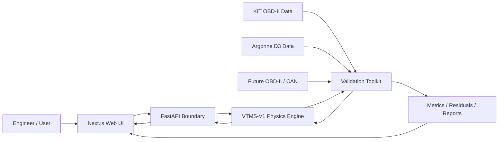
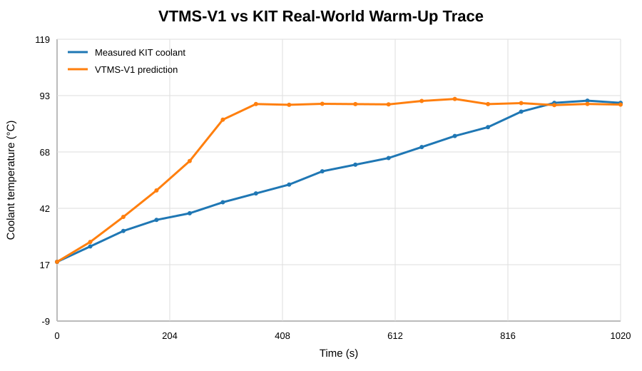
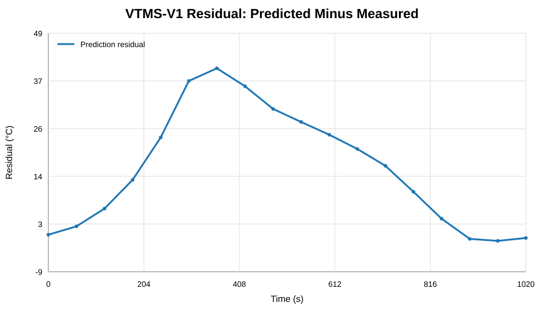

# VTMS

## Vehicle Thermal Management Simulation Platform

**VTMS-V1** is a physics-based automotive thermal-management simulation platform built around a deterministic Python/SciPy engineering model, numerical verification, external validation tooling, a FastAPI execution boundary, and a responsive Next.js engineering interface.

The project is intentionally **engineering first**. Presentation, API transport, deployment infrastructure, and future AI capabilities remain above the physics layer rather than replacing it.

> **Current classification:** Generic physics-based lumped-parameter transient thermal simulation. VTMS-V1 is not an OEM-calibrated vehicle model and is not yet a synchronized digital twin.

## Why this project exists

VTMS explores the intersection of mechanical engineering, automotive systems, scientific computing, validation, and software engineering. Calculated quantities must come from governing equations, sourced properties, measured inputs, calibrated parameters, or explicitly identified assumptions.

The project is built around three questions:

1. Can the frozen thermal model be implemented consistently and conserve energy numerically?
2. Can predictions be compared against independent real-world telemetry without contaminating the model through premature tuning?
3. Can a modern web application expose the engineering model without moving thermal calculations into the browser or overstating model maturity?

## Current status

| Area | Status |
|---|---|
| Physics specification | Complete, VTMS-V1 Engineering Model Specification 1.0.0 |
| Standalone Python engine | Complete |
| Numerical integration | SciPy `solve_ivp`, RK45 |
| Automated Python/API tests | **47 passing** |
| Engineering verification checks | **21 passing** |
| Canonical scenario suite | S-01 through S-09 implemented |
| Energy-conservation verification | Passing |
| External real-world plausibility test | Complete using KIT OBD-II telemetry |
| Controlled validation governance | Complete: manifests, role separation, file hashes, parameter hashes, holdout protection |
| Formal acceptance evaluator | Complete: project metrics plus 60/80/90 degC timing decisions |
| Synthetic bounded-calibration harness | Complete: calibration, freeze, untouched synthetic holdout, nonphysical acceptance test |
| Argonne D3 controlled validation | Data and official signal mapping still pending |
| UI/UX foundation | Complete |
| UI-1 Next.js application shell | Complete |
| UI-2 FastAPI simulation boundary | Complete |
| Custom and fault Simulation Lab execution | Complete |
| UI-3 production packaging and hardening | Complete |
| UI-4 light production UX and browser QA | Complete |
| UI-5 visual productization and engineering visuals | Complete |
| Creator / About page | Complete |
| Local VTMS knowledge assistant (no external AI API) | Complete |
| Production dependency audit | Passing at high severity threshold |
| API and web container smoke tests | Passing |
| Public application deployment | Live at `https://vtms.up.railway.app` |
| Public API deployment | Live at `https://vtms-api.up.railway.app` |
| Vehicle-specific digital twin | Future maturity target |

## Architecture



The browser never calculates VTMS thermal physics. Simulation Lab sends a scenario request to FastAPI. The API validates and translates the public request into the existing Python `Scenario` contract, invokes `SimulationRunner`, and returns the authoritative serialized `SimulationResult`.

Computed runs are currently stored only in browser session storage. A returned run is immutable and rendered through `/results/[runId]`. No database is required for the current application layer.

Production packaging keeps the same boundary. The Next.js and FastAPI services are built as separate non-root containers, with independent health checks and Railway configuration files.

For the complete engineering and software map, see [`ARCHITECTURE.md`](ARCHITECTURE.md). For validation controls, see [`docs/VALIDATION_GOVERNANCE.md`](docs/VALIDATION_GOVERNANCE.md). For the nonphysical calibration dry run, see [`docs/SYNTHETIC_CALIBRATION_HARNESS.md`](docs/SYNTHETIC_CALIBRATION_HARNESS.md). For production setup and verification, see [`docs/DEPLOYMENT.md`](docs/DEPLOYMENT.md).

## VTMS-V1 thermal model

VTMS-V1 uses two transient state temperatures:

- `T_e`: effective engine-structure temperature
- `T_c`: bulk engine-side coolant temperature

Radiator outlet temperature is derived algebraically rather than integrated as a third state.

The core balances are:

```text
C_e dT_e/dt = Q_engine - Q_ec - Q_ea
C_c dT_c/dt = Q_ec - Q_rad
```

with:

```text
Q_ec = UA_ec (T_e - T_c)
Q_ea = UA_ea (T_e - T_a)
```

Radiator heat rejection uses a crossflow effectiveness-NTU formulation. Pump flow, thermostat and bypass behavior, fan airflow, ram airflow, radiator degradation, pump degradation, airflow degradation, and supported faults are deterministic component models.

## Repository layout

```text
.
├── README.md
├── ARCHITECTURE.md
├── IMPLEMENTATION_AUDIT.md
├── VERIFICATION_RESULTS.md
├── KIT_DATASET_AUDIT.md
├── VALIDATION_TOOLKIT_README.md
├── Dockerfile.api
├── railway.json
├── pyproject.toml
├── run_synthetic_calibration.py
├── docs/
│   ├── DEPLOYMENT.md
│   ├── VALIDATION_GOVERNANCE.md
│   ├── SYNTHETIC_CALIBRATION_HARNESS.md
│   ├── UI_UX_PRODUCT_SPEC.md
│   ├── INFORMATION_ARCHITECTURE.md
│   ├── LOW_FIDELITY_WIREFRAMES.md
│   ├── VTMS_V1_Engineering_Model_Specification.docx
│   ├── VTMS_V1_Physical_Validation_Protocol.docx
│   └── images/
├── src/
│   ├── vtms_v1/
│   ├── vtms_validation/
│   └── vtms_api/
├── tests/
├── tests_validation/
├── tests_api/
├── validation_configs/
├── validation_data/
├── validation_outputs/
└── web/
    ├── Dockerfile
    ├── railway.json
    ├── app/
    ├── components/
    ├── lib/
    ├── public/
    └── package.json
```

## Simulation workflow

```text
Simulation Lab
      ↓
UI-facing scenario request
      ↓
POST /api/v1/simulations
      ↓
FastAPI validation + unit translation
      ↓
Python Scenario
      ↓
SimulationRunner
      ↓
Authoritative SimulationResult
      ↓
Browser session storage
      ↓
/results/[runId]
      ↓
Synchronized charts + thermal-system playback
```

### Canonical scenario integrity

S-01 through S-09 are frozen engineering cases. The API protects those identities.

If a request uses a canonical scenario ID but changes a physical input or fault state, the API rejects it. The UI labels edited presets with a `CUSTOM-` scenario ID instead. This prevents modified runs from being mistaken for the frozen regression scenarios.

### API endpoints

```text
GET  /health
GET  /api/v1/model
GET  /api/v1/scenarios
POST /api/v1/simulations
```

The API exposes human-facing inputs such as km/h and load percent, then converts them once at the server boundary into the core SI/normalized units used by `Scenario`.

## Verification, security, and CI

Verification answers a software and mathematics question:

> Does the implementation solve the frozen VTMS-V1 equations consistently?

The automated suite now contains **47 tests** across the engine, validation toolkit, controlled-validation governance, acceptance evaluator, bounded-calibration harness, API boundary, and production HTTP behavior. It covers energy conservation, solver convergence, component invariants, canonical regression behavior, fault direction, validation adapters, dataset hashing, calibration/holdout separation, parameter-snapshot locking, explicit physical-evidence declaration, Argonne signal mapping and unit normalization, formal heat-evidence restrictions, project acceptance decisions, synthetic bounded fitting, frozen synthetic holdout execution, request validation, API unit translation, canonical scenario protection, authoritative API execution, runtime metadata, and production response headers.

GitHub Actions now runs:

```text
Python 3.11 test suite
Python 3.12 test suite
Python 3.13 test suite
Web dependency install
Production dependency audit
Web ESLint
Web TypeScript check
Web production build
API Docker image build + boot + /health smoke test
Web Docker image build + boot + /api/health smoke test
```

UI-3 also adds weekly Dependabot monitoring, standalone Next.js output, non-root containers, API response compression, bounded simulation concurrency, production security headers, explicit no-store API caching, configurable API documentation exposure, and Railway health-check configuration.

The production dependency gate initially identified high-severity transitive issues in the web stack. Next.js was upgraded from 16.2.11 to 16.3.1, after which the high-severity production audit passed together with lint, typecheck, build, and both container smoke tests.

The web repository does not currently commit a `package-lock.json`. Installation therefore uses the declared package ranges rather than claiming lockfile-based reproducibility. See [`docs/DEPLOYMENT.md`](docs/DEPLOYMENT.md) for that limitation and the recommended future improvement.

See [`VERIFICATION_RESULTS.md`](VERIFICATION_RESULTS.md) and [`IMPLEMENTATION_AUDIT.md`](IMPLEMENTATION_AUDIT.md).

## Real-world plausibility testing

The validation layer remains separate from both FastAPI and the web interface.

The first external comparison used an independent KIT Seat Leon OBD-II warm-up trace. **No VTMS parameters were changed for this comparison.**

Results:

- RMSE: **21.40 °C**
- MAE: **16.50 °C**
- mean bias: **+16.13 °C**
- 60 °C arrival: approximately **276 seconds early**
- 80 °C arrival: approximately **496 seconds early**
- final error after 1020 seconds: **-0.79 °C**

VTMS reaches a similar final operating-temperature region but warms substantially too quickly relative to this trace. The mismatch is preserved as evidence rather than tuned away.

### Measured versus predicted coolant temperature



### Prediction residual



This remains **external plausibility evidence**, not controlled physical validation.

## Controlled physical validation strategy

Formal V1 validation remains designed around controlled Argonne National Laboratory D3 dynamometer data. The execution path is now governed in code before those files arrive.

Every controlled run must carry an immutable manifest containing its dataset ID, raw-file SHA-256, validation role, evidence grade, model/equation identifiers, parameter-set identifier, parameter-snapshot SHA-256, acceptance criteria, an explicit physical-evidence flag, and any preregistered fitted-parameter declaration. `physical_evidence` defaults to false, so generated or synthetic traces cannot become formal validation claims by labeling them as holdouts.

The only allowed calibration subset is:

1. `wall_heat_fraction`
2. `engine_thermal_capacitance_j_per_k`
3. `engine_coolant_ua_w_per_k`
4. `radiator_ua_nominal_w_per_k`

Holdout and challenge manifests cannot authorize fitting. The controlled runner also refuses to execute if the normalized dataset's raw-file hash, dataset ID, or parameter snapshot does not match the manifest.

Formal controlled evidence must use an explicit fuel-energy-rate channel or a direct fuel-rate channel with a declared lower heating value. The KIT-style MAF stoichiometric proxy is prohibited from calibration and holdout execution and remains limited to plausibility work.

The formal acceptance evaluator applies the preregistered project thresholds: RMSE <= 5 degC, MAE <= 4 degC, absolute bias <= 3 degC, P90 absolute error <= 7 degC, and 60/80/90 degC timing error within the larger of 60 seconds or 10 percent of measured arrival time. Numeric threshold success alone is not enough for a validation claim. `formal_validation_pass` additionally requires an independent holdout role and `physical_evidence=true`.

The preregistered sequence is:

1. Obtain qualified 72 °F conventional gasoline vehicle runs and the official channel definitions.
2. Hash and archive each raw source file.
3. Assign calibration, holdout, and challenge roles before fitting.
4. Map official D3 channel names and units explicitly into the VTMS validation contract.
5. Establish and preregister physically justified calibration bounds before fitting.
6. Select one calibration run.
7. Permanently reserve separate runs as untouched holdouts.
8. Calibrate only the preregistered uncertain parameters within the approved bounds.
9. Freeze and hash the resulting parameter snapshot.
10. Execute holdout predictions without retuning.
11. Evaluate the frozen holdout with the formal acceptance evaluator.
12. Publish metrics, residuals, acceptance decisions, and limitations regardless of outcome.

`ArgonneD3Adapter` still refuses schema guessing. It can normalize explicitly mapped CSV data only after a reviewed `ArgonneSignalMap` names every source column and unit. If the received D3 package uses another format, a dedicated parser will be added only after that format is documented.

See [`docs/VALIDATION_GOVERNANCE.md`](docs/VALIDATION_GOVERNANCE.md), [`docs/SYNTHETIC_CALIBRATION_HARNESS.md`](docs/SYNTHETIC_CALIBRATION_HARNESS.md), [`validation_configs/argonne_d3_mapping.template.json`](validation_configs/argonne_d3_mapping.template.json), [`validation_configs/argonne_validation_plan.template.json`](validation_configs/argonne_validation_plan.template.json), and [`docs/VTMS_V1_Physical_Validation_Protocol.docx`](docs/VTMS_V1_Physical_Validation_Protocol.docx).

## Synthetic calibration pipeline verification

VTMS includes a deterministic software-only dry run for the future physical calibration workflow.

`run_synthetic_calibration.py` generates a synthetic calibration trace from a known VTMS-V1 parameter set, begins from the generic parameter snapshot, and uses SciPy bounded nonlinear least squares to fit only the four manifest-authorized parameters. The harness then freezes the fitted snapshot and evaluates a separate synthetic holdout that was never seen by the optimizer.

The harness proves that:

- explicit bounds are enforced,
- only manifest-authorized parameters can move,
- the optimizer reduces the calibration residual,
- the fitted parameter snapshot is frozen and hashed,
- a separate holdout uses that frozen snapshot,
- the acceptance evaluator executes end to end, and
- synthetic success cannot become a formal physical-validation claim.

The bounds in this synthetic exercise are test fixtures only. They are deliberately not approved for Argonne calibration. Real physical bounds remain unresolved until they can be justified and preregistered without reference to observed Argonne fit residuals.

## Production deployment

VTMS is publicly deployed as two Railway services from this repository:

```text
https://vtms.up.railway.app      -> Next.js frontend
https://vtms-api.up.railway.app  -> FastAPI + authoritative VTMS-V1 engine
```

The services have repository-controlled Dockerfiles, health endpoints, and `railway.json` configuration. Public domain and CORS settings remain environment configuration rather than committed source code.

The live application has completed an end-to-end S-03 execution from the browser through FastAPI into the Python `SimulationRunner`, plus browser-rendered QA passes at mobile and desktop viewport sizes. UI-5 repeated that QA at 360, 390, 430, 768, 1024, and 1440 px across every route.

See [`docs/DEPLOYMENT.md`](docs/DEPLOYMENT.md).

## Local development

### Python, API, and tests

Requires Python 3.11+.

```text
python -m pip install -e ".[api,dev]"
python -m pytest
python -m uvicorn vtms_api.app:app --reload --port 8000
```

To exercise the nonphysical calibration/holdout pipeline:

```text
python run_synthetic_calibration.py
```

Local API CORS defaults to the Next.js development origins. Deployment origins are configured with:

```text
VTMS_CORS_ORIGINS=https://your-frontend.example
```

### Web application

Requires Node.js 20.9+.

```text
cd web
npm install
npm run dev
```

The browser defaults to `http://localhost:8000` for the API. Override with:

```text
NEXT_PUBLIC_VTMS_API_URL=https://your-api.example
```

Web quality gates:

```text
npm run lint
npm run typecheck
npm run build
```

## Engineering boundaries

VTMS-V1 intentionally does not model coolant pressure or boiling, two-phase flow, detailed coolant-jacket hydraulics, oil thermal behavior, heater-core heat extraction, cabin HVAC loads, A/C condenser coupling, transmission cooling, local cylinder-head hot spots, underhood CFD, OEM-specific control strategies, live OBD-II/CAN synchronization, or AI-generated thermal calculations.

High-temperature fault cases above the liquid-only caution boundary are therefore treated qualitatively rather than as predictions of boiling or mechanical damage.

## Roadmap

### VTMS-V1

- [x] Freeze engineering model specification
- [x] Implement standalone Python physics engine
- [x] Implement component and fault models
- [x] Add automated verification and regression tests
- [x] Build dataset-independent validation toolkit
- [x] Run first untouched real-world plausibility comparison
- [x] Freeze UI/UX product foundation
- [x] Implement UI-1 Next.js application shell
- [x] Implement UI-2 FastAPI simulation boundary
- [x] Execute custom and fault Simulation Lab runs through the Python engine
- [x] Protect canonical scenario identities at the API boundary
- [x] Complete UI-3 production packaging and hardening
- [x] Deploy Railway API and web services
- [x] Complete UI-4 light production UX and browser/device QA
- [x] Complete UI-5 visual productization, interactive thermal schematic, and responsive visual QA
- [x] Add the creator page and a local knowledge assistant with no external AI dependency
- [x] Add dependency audit and container smoke gates
- [x] Add controlled-validation manifests and evidence-role enforcement
- [x] Add raw-data and parameter-snapshot provenance locks
- [x] Add explicit Argonne signal-mapping and validation-plan templates
- [x] Add formal project acceptance evaluator
- [x] Add synthetic bounded-calibration and untouched-holdout harness
- [ ] Establish physically justified Argonne calibration bounds before fitting
- [ ] Receive and qualify Argonne D3 raw files and signal dictionary
- [ ] Complete Argonne D3 calibration and blind holdout validation
- [ ] Publish formal controlled validation results

### VTMS-V2

Vehicle-specific calibrated parameter sets, direct OBD-II/CAN replay, justified model extensions based on residual analysis, and stronger uncertainty and sensitivity analysis.

### Future connected model / digital twin

Synchronized physical-vehicle telemetry, state estimation, continuous calibration, vehicle-specific prediction, and AI-assisted interpretation above the deterministic physics layer.

## Documentation

- [`ARCHITECTURE.md`](ARCHITECTURE.md): complete engineering and software architecture
- [`docs/VALIDATION_GOVERNANCE.md`](docs/VALIDATION_GOVERNANCE.md): controlled evidence roles, provenance locks, calibration/holdout separation, and Argonne mapping policy
- [`docs/SYNTHETIC_CALIBRATION_HARNESS.md`](docs/SYNTHETIC_CALIBRATION_HARNESS.md): nonphysical bounded-fitting, freeze, holdout, and acceptance dry run
- [`docs/DEPLOYMENT.md`](docs/DEPLOYMENT.md): production topology, Railway configuration, health checks, verification, and rollback
- [`docs/UI_UX_PRODUCT_SPEC.md`](docs/UI_UX_PRODUCT_SPEC.md): UI product principles and interaction contracts
- [`docs/INFORMATION_ARCHITECTURE.md`](docs/INFORMATION_ARCHITECTURE.md): route hierarchy and user flows
- [`docs/LOW_FIDELITY_WIREFRAMES.md`](docs/LOW_FIDELITY_WIREFRAMES.md): desktop and mobile screen structures
- [`web/README.md`](web/README.md): web and API execution boundary
- [`docs/VTMS_V1_Engineering_Model_Specification.docx`](docs/VTMS_V1_Engineering_Model_Specification.docx): frozen V1 physics contract
- [`docs/VTMS_V1_Physical_Validation_Protocol.docx`](docs/VTMS_V1_Physical_Validation_Protocol.docx): preregistered validation plan
- [`IMPLEMENTATION_AUDIT.md`](IMPLEMENTATION_AUDIT.md): implementation decisions and specification gaps
- [`VERIFICATION_RESULTS.md`](VERIFICATION_RESULTS.md): numerical verification results
- [`KIT_DATASET_AUDIT.md`](KIT_DATASET_AUDIT.md): external dataset qualification and limitations
- [`VALIDATION_TOOLKIT_README.md`](VALIDATION_TOOLKIT_README.md): validation package operation

## Data attribution

The reduced KIT sample in this repository is derived from the **KIT Automotive OBD-II Dataset**, DOI `10.35097/1130`, licensed under **CC BY 4.0**. It is included only as a small external plausibility case.

## License

Source code in this repository is released under the [MIT License](LICENSE). External datasets and derived samples remain subject to their respective source licenses and attribution requirements.
