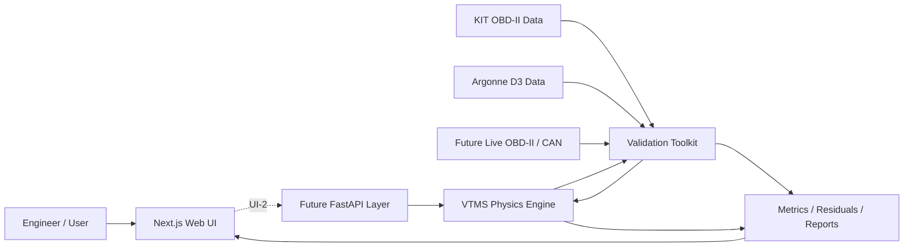

# VTMS

## Vehicle Thermal Management Simulation Platform

**VTMS-V1** is a physics-based automotive thermal-management simulation platform implemented in Python and SciPy. It models transient engine and coolant behavior, thermostat and bypass flow, pump behavior, vehicle-speed and fan airflow, and radiator heat rejection using a crossflow effectiveness-NTU formulation.

The project is intentionally built **engineering first**. The deterministic simulation core, numerical verification suite, external validation tooling, and web presentation layer are kept separate so presentation never becomes a substitute for engineering evidence.

> **Current classification:** Generic physics-based lumped-parameter transient thermal simulation. VTMS-V1 is not an OEM-calibrated vehicle model and is not yet a synchronized digital twin.

## Why this project exists

VTMS explores the intersection of mechanical engineering, automotive systems, scientific computing, validation, and software engineering. The goal is not to produce a dashboard that displays invented values. The goal is to build a traceable engineering platform where calculated quantities come from governing equations, sourced properties, measured inputs, calibrated parameters, or explicitly identified assumptions.

The current work centers on three questions:

1. Can the frozen thermal model be implemented consistently and conserve energy numerically?
2. Can the validation pipeline compare predictions against independent real-world telemetry without contaminating the model through premature tuning?
3. Can a modern web interface make the thermal system understandable without moving the physics into the browser or overstating model maturity?

## Current status

| Area | Status |
|---|---|
| Physics specification | Complete, VTMS-V1 Engineering Model Specification 1.0.0 |
| Standalone Python engine | Complete |
| Numerical integration | SciPy `solve_ivp`, RK45 |
| Full engine + validation tests | **22 passing** |
| Engineering verification checks | **21 passing** |
| Canonical fault/scenario suite | S-01 through S-09 implemented |
| Energy-conservation verification | Passing |
| External real-world plausibility test | Complete using KIT OBD-II telemetry |
| Controlled physical validation | Pending Argonne D3 raw data |
| UI/UX foundation | Complete |
| UI-1 Next.js application shell | Complete |
| Web lint / typecheck / production build | Enforced in GitHub Actions |
| FastAPI simulation boundary | Next implementation milestone |
| Vehicle-specific digital twin | Future maturity target |

## Architecture



The current repository implements the **physics engine**, **validation toolkit**, and **UI-1 web application shell**. The web layer visualizes engineering contracts and an immutable result fixture generated by the Python engine. It does not implement thermal equations in React.

The next application boundary is FastAPI. That layer will accept a scenario specification, invoke the existing Python `SimulationRunner`, and serialize the authoritative `SimulationResult` for the web client.

For the complete technical map, see [`ARCHITECTURE.md`](ARCHITECTURE.md).

## VTMS-V1 thermal model

VTMS-V1 freezes two transient state temperatures:

- `T_e`: effective engine-structure temperature
- `T_c`: bulk engine-side coolant temperature

Radiator outlet temperature is derived algebraically rather than treated as a third ODE state. This avoids double-counting radiator thermal storage in the V1 lumped model.

The core balances are:

```text
C_e dT_e/dt = Q_engine - Q_ec - Q_ea
C_c dT_c/dt = Q_ec - Q_rad
```

with:

```text
Q_ec = UA_ec (T_e - T_c)
Q_ea = UA_ea (T_e - T_a)
```

Radiator heat rejection is calculated with a crossflow effectiveness-NTU model. Coolant circulation, thermostat/bypass behavior, fan airflow, ram airflow, radiator degradation, pump degradation, and component faults are separate deterministic model components.

## Repository layout

```text
.
├── README.md
├── ARCHITECTURE.md
├── IMPLEMENTATION_AUDIT.md
├── VERIFICATION_RESULTS.md
├── KIT_DATASET_AUDIT.md
├── VALIDATION_TOOLKIT_README.md
├── pyproject.toml
├── docs/
│   ├── UI_UX_PRODUCT_SPEC.md
│   ├── INFORMATION_ARCHITECTURE.md
│   ├── LOW_FIDELITY_WIREFRAMES.md
│   ├── VTMS_V1_Engineering_Model_Specification.docx
│   ├── VTMS_V1_Physical_Validation_Protocol.docx
│   └── images/
├── src/
│   ├── vtms_v1/
│   └── vtms_validation/
├── tests/
├── tests_validation/
├── validation_data/
├── validation_outputs/
└── web/
    ├── app/
    ├── components/
    ├── lib/
    ├── public/
    ├── package.json
    └── README.md
```

## Verification

Verification answers a software and mathematics question:

> Does the implementation solve the frozen VTMS-V1 equations consistently?

The automated verification work includes numerical energy conservation, solver convergence, component invariants, zero-flow safeguards, fault-direction behavior, metadata and parameter provenance, and regression checks against all nine canonical scenarios.

See [`VERIFICATION_RESULTS.md`](VERIFICATION_RESULTS.md) and [`IMPLEMENTATION_AUDIT.md`](IMPLEMENTATION_AUDIT.md).

## Real-world plausibility testing

The validation layer is intentionally separate from the physics engine. External sources are normalized into a common `ValidationDataset` contract containing time, measured coolant temperature, engine RPM, vehicle speed, ambient temperature, and optional fuel or airflow signals.

The first external comparison used a real KIT Seat Leon OBD-II warm-up trace. **No VTMS parameters were changed for the comparison.**

The result exposed an important transient-model question:

- RMSE: **21.40 °C**
- MAE: **16.50 °C**
- mean bias: **+16.13 °C**
- 60 °C arrival: approximately **276 seconds early**
- 80 °C arrival: approximately **496 seconds early**
- final error after 1020 seconds: **-0.79 °C**

VTMS reaches a similar final operating-temperature region but warms substantially too quickly relative to this trace. The model was deliberately **not recalibrated** in response.

### Measured versus predicted coolant temperature


### Prediction residual


This is classified as an **external plausibility check**, not formal vehicle validation. See [`KIT_DATASET_AUDIT.md`](KIT_DATASET_AUDIT.md) and [`validation_outputs/FIRST_COMPARISON_FINDINGS.md`](validation_outputs/FIRST_COMPARISON_FINDINGS.md).

## Physical validation strategy

Formal V1 validation is designed around controlled Argonne National Laboratory D3 dynamometer data.

The preregistered process is:

1. Obtain qualified 72 °F conventional gasoline vehicle runs and the associated channel dictionary.
2. Select one calibration run.
3. Permanently reserve separate runs as untouched holdouts.
4. Calibrate only the preregistered uncertain parameters.
5. Freeze the calibration.
6. Run holdout predictions without using measured coolant temperature after initialization.
7. Report RMSE, MAE, bias, P90 error, maximum error, warm-up threshold timing, residuals, and limitations.

The Argonne adapter currently refuses to guess the raw D3 schema. It will be implemented only after the official channel names and units are available.

The formal preregistered process is documented in [`docs/VTMS_V1_Physical_Validation_Protocol.docx`](docs/VTMS_V1_Physical_Validation_Protocol.docx).

## UI-1 web application

UI-1 turns the approved product architecture into an executable responsive web shell under [`web/`](web/).

Primary routes:

```text
/                     Overview
/simulate             Simulation Lab
/system               System Explorer
/scenarios            Scenario Library
/results/demo-s03     Canonical result workspace
/validation           Validation Evidence
/model                Engineering Model
/roadmap              Maturity Roadmap
```

The visual direction is a modern automotive engineering workstation rather than a generic SaaS dashboard. The system schematic, transient response, engineering status, and evidence classification are the primary interface objects.

### Authoritative UI fixture

The UI-1 playback is not invented sample data. The included S-03 fixture was generated by the existing VTMS-V1 Python `SimulationRunner` from the frozen Hot Ambient Idle scenario and then down-sampled for web presentation.

The fixture is intentionally immutable. The UI labels it as **simulation playback**, not live telemetry.

### Simulation Lab boundary

UI-1 exposes the existing scenario contract, including operating conditions and supported model concepts, but it does not execute edited inputs in JavaScript.

Until FastAPI is implemented:

- React does not calculate engine heat, coolant temperature, thermostat behavior, airflow, or radiator heat rejection.
- An unchanged S-03 preset can open the authoritative fixture result.
- Edited configurations remain visibly pending rather than producing fabricated results.

This keeps the UI honest while establishing the complete workflow for UI-2.

### Web quality gate

The GitHub Actions workflow now checks both sides of the project:

```text
Python 3.11 test suite
Python 3.12 test suite
Python 3.13 test suite
Web dependency install
Web ESLint
Web TypeScript check
Web production build
```

See [`web/README.md`](web/README.md) for the web-specific implementation boundary.

## UI/UX foundation documents

The implementation is governed by the frozen UI foundation:

- [`docs/UI_UX_PRODUCT_SPEC.md`](docs/UI_UX_PRODUCT_SPEC.md)
- [`docs/INFORMATION_ARCHITECTURE.md`](docs/INFORMATION_ARCHITECTURE.md)
- [`docs/LOW_FIDELITY_WIREFRAMES.md`](docs/LOW_FIDELITY_WIREFRAMES.md)

The web client visualizes authoritative results returned by the engineering core. Simulation playback is explicitly distinguished from live vehicle telemetry, and evidence maturity remains visible throughout the product.

## Python installation

Requires **Python 3.11+**.

```text
python -m pip install -e ".[dev]"
```

Run the full automated suite:

```text
python -m pytest
```

Run the engineering verification report:

```text
python run_verification.py
```

Run the included KIT plausibility comparison:

```text
python run_kit_plausibility.py
```

## Web development

The web application is isolated under `web/`.

```text
cd web
npm install
npm run dev
```

Quality gates:

```text
npm run lint
npm run typecheck
npm run build
```

## Python example

```python
from vtms_v1.scenarios import canonical_scenarios
from vtms_v1.simulation import SimulationRunner

scenario = canonical_scenarios()["S-01"]
result = SimulationRunner().run(scenario)

print(result.model_metadata)
print(result.energy_balance)
print(result.time_series[-1])
```

## Engineering boundaries

VTMS-V1 intentionally does not model coolant pressure or boiling, two-phase flow, detailed coolant-jacket hydraulics, oil thermal behavior, heater-core heat extraction, cabin HVAC loads, A/C condenser coupling, transmission cooling, local cylinder-head hot spots, underhood CFD, OEM-specific control strategies, live OBD-II/CAN synchronization, or AI-generated thermal calculations.

High-temperature fault cases that exceed the liquid-only caution boundary are therefore treated qualitatively rather than as predictions of damage or boiling behavior.

## Roadmap

### VTMS-V1

- [x] Freeze engineering model specification
- [x] Implement standalone Python physics engine
- [x] Implement component and fault models
- [x] Add automated verification and regression tests
- [x] Build dataset-independent validation toolkit
- [x] Run first untouched real-world plausibility comparison
- [x] Freeze UI/UX product foundation
- [x] Implement UI-1 Next.js application shell
- [x] Add independent web lint, typecheck, and production-build CI
- [ ] Implement UI-2 FastAPI simulation boundary
- [ ] Execute custom Simulation Lab scenarios through the Python engine
- [ ] Complete Argonne D3 calibration and blind holdout validation
- [ ] Publish formal validation results

### VTMS-V2

Vehicle-specific calibrated parameter sets, direct OBD-II/CAN replay, justified model extensions based on residual analysis, and stronger uncertainty and sensitivity analysis.

### Future connected model / digital twin

Synchronized physical-vehicle telemetry, state estimation, continuous calibration, vehicle-specific prediction, and AI-assisted interpretation above the deterministic physics layer.

## Documentation

- [`ARCHITECTURE.md`](ARCHITECTURE.md): complete software and engineering architecture
- [`docs/UI_UX_PRODUCT_SPEC.md`](docs/UI_UX_PRODUCT_SPEC.md): UI product principles, page responsibilities, interaction contracts, design direction, and implementation phases
- [`docs/INFORMATION_ARCHITECTURE.md`](docs/INFORMATION_ARCHITECTURE.md): route hierarchy, user flows, page ownership, and responsive navigation
- [`docs/LOW_FIDELITY_WIREFRAMES.md`](docs/LOW_FIDELITY_WIREFRAMES.md): desktop and mobile screen structures
- [`web/README.md`](web/README.md): executable UI-1 scope and web engineering boundary
- [`docs/VTMS_V1_Engineering_Model_Specification.docx`](docs/VTMS_V1_Engineering_Model_Specification.docx): frozen V1 physics and implementation contract
- [`docs/VTMS_V1_Physical_Validation_Protocol.docx`](docs/VTMS_V1_Physical_Validation_Protocol.docx): preregistered calibration and holdout validation plan
- [`IMPLEMENTATION_AUDIT.md`](IMPLEMENTATION_AUDIT.md): implementation decisions and specification gaps
- [`VERIFICATION_RESULTS.md`](VERIFICATION_RESULTS.md): numerical verification results
- [`KIT_DATASET_AUDIT.md`](KIT_DATASET_AUDIT.md): external dataset qualification and limitations
- [`VALIDATION_TOOLKIT_README.md`](VALIDATION_TOOLKIT_README.md): validation package operation

## Data attribution

The reduced KIT sample in this repository is derived from the **KIT Automotive OBD-II Dataset**, DOI `10.35097/1130`, licensed under **CC BY 4.0**. It is included only as a small external plausibility case.

## License

Source code in this repository is released under the [MIT License](LICENSE). External datasets and derived samples remain subject to their respective source licenses and attribution requirements.
