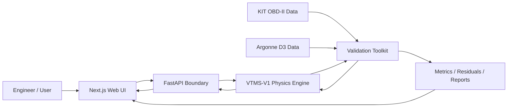

# VTMS

## Vehicle Thermal Management Simulation Platform

**VTMS-V1** is a physics-based automotive thermal-management simulation platform built around a deterministic Python/SciPy engineering model, numerical verification, controlled physical-validation governance, a FastAPI execution boundary, and a responsive Next.js interface.

> **Current standing:** VTMS-V1 is numerically verified but did **not** pass its preregistered controlled physical-validation criteria. The production/default parameter set remains the generic V1 set. Controlled Argonne calibration artifacts are preserved separately and are not silently promoted into the production model. VTMS-V1 is not an OEM vehicle model and is not a synchronized digital twin.

## Live project

- Web: `https://vtms.up.railway.app`
- API: `https://vtms-api.up.railway.app`
- Creator: Michael Palmer
- Local VTMS knowledge assistant: included in the web app with no external AI API

## What VTMS is testing

VTMS asks three questions:

1. Can the frozen thermal equations be implemented consistently and conserve energy numerically?
2. Can the model be compared against independent physical evidence without contaminating holdouts through post-hoc tuning?
3. Can a modern web application expose the engineering model without moving thermal calculations into the browser or overstating model maturity?

The first answer is **yes**. The controlled physical-validation program has now answered the second question more critically: the current V1 model form is **not accurate enough to pass the preregistered Argonne holdout criteria**.

## Current status

| Area | Status |
|---|---|
| Physics specification | Complete, VTMS-V1 Engineering Model Specification 1.0.0 |
| Standalone Python engine | Complete |
| Numerical integration | SciPy `solve_ivp`, RK45 |
| Automated Python/API tests | **83 passing** on Python 3.11, 3.12, and 3.13 |
| Engineering verification checks | **21 passing** |
| Canonical scenarios | S-01 through S-09 frozen and implemented |
| Energy-conservation verification | Passing |
| KIT external plausibility | Complete, mismatch preserved without tuning |
| Argonne D3 acquisition / hashing / mapping | Complete |
| Physical calibration bounds | Frozen before Argonne residual inspection |
| Synthetic identifiability preflight | Complete |
| CAL-01 cold-start calibration | Complete, project calibration-stage thresholds met with boundary cautions |
| CAL-RAD-01 radiator calibration | Complete, **outside project thresholds** |
| VAL-HOT-01 primary independent holdout | Complete, **formal holdout acceptance failed** |
| Holdout-driven retuning | Prohibited |
| UI-5 visual productization | Complete |
| About / creator page | Complete |
| Local VTMS knowledge assistant | Complete, no external AI service |
| Production dependency audit | Passing at high severity threshold |
| API and web container smoke tests | Passing |
| Vehicle-specific digital twin | Future maturity target |

## Architecture



The browser does not calculate governing thermal physics. Simulation Lab sends a scenario request to FastAPI. FastAPI validates the request, invokes the authoritative Python `SimulationRunner`, and returns the resulting simulation record.

The validation toolkit remains separate from both the transport boundary and presentation layer. External data are normalized through explicit adapters, fingerprints, reviewed mappings, immutable manifests, and evidence-role controls.

## VTMS-V1 thermal model

The model has two transient state temperatures:

- `T_e`: effective engine-structure temperature
- `T_c`: bulk engine-side coolant temperature

Radiator outlet temperature is algebraic rather than a third integrated state.

```text
C_e dT_e/dt = Q_engine - Q_ec - Q_ea
C_c dT_c/dt = Q_ec - Q_rad

Q_ec = UA_ec (T_e - T_c)
Q_ea = UA_ea (T_e - T_a)
```

Radiator rejection uses a crossflow effectiveness-NTU formulation. Pump flow, thermostat/bypass behavior, fan airflow, ram airflow, and the supported degradation/fault controls are deterministic component models.

Frozen V1 numerics:

- SciPy `solve_ivp`
- RK45
- relative tolerance `1e-6`
- absolute tolerance `1e-8`
- maximum internal step `1 s`
- approximately `1 s` output interval

## Verification is not validation

Numerical verification asks whether the implementation solves the frozen VTMS-V1 equations consistently. The suite covers conservation, convergence, component invariants, canonical regression behavior, API translation, evidence-role enforcement, provenance hashes, bounded calibration, identifiability controls, and holdout protections.

CI also runs the web dependency audit, ESLint, TypeScript, local-assistant tests, Next.js production build, and API/web container smoke tests.

Passing these checks does **not** establish vehicle-specific physical accuracy.

## External plausibility: KIT

The first untouched external comparison used the KIT Automotive OBD-II Dataset with no parameter tuning.

- RMSE: **21.40 °C**
- MAE: **16.50 °C**
- mean bias: **+16.13 °C**
- 60 °C arrival: about **276 s early**
- 80 °C arrival: about **496 s early**
- final error after 1020 s: **-0.79 °C**

The generic model reached a similar final operating region but warmed too quickly. This remains `external_plausibility_not_formal_validation`.

## Controlled Argonne D3 program

Argonne National Laboratory supplied controlled 2012 Ford Focus dynamometer data on **2026-08-17**. The received files include ECT, engine speed, dyno speed, cell temperature, direct bench fuel flow, MAF, load, and additional instrumentation.

Raw Argonne attachments are not redistributed in this repository. VTMS stores source fingerprints, reviewed mappings, role decisions, manifests, and derived result records.

### Frozen physical calibration bounds

These effective-model bounds were frozen before any VTMS-vs-Argonne residual was inspected:

| Parameter | Lower | Upper | Generic V1 |
|---|---:|---:|---:|
| `wall_heat_fraction` | 0.20 | 0.50 | 0.28 |
| `engine_thermal_capacitance_j_per_k` | 25,000 J/K | 100,000 J/K | 50,000 J/K |
| `engine_coolant_ua_w_per_k` | 400 W/K | 2,200 W/K | 1,000 W/K |
| `radiator_ua_nominal_w_per_k` | 400 W/K | 2,200 W/K | 1,100 W/K |

Synthetic pre-fit analysis showed that radiator UA was weakly excited by the warm-up profiles, so all four parameters were prohibited from moving in one cold-start optimizer stage.

### CAL-01: cold-start UDDS #1, test 71207062

CAL-01 fitted only wall heat fraction, effective engine capacitance, and engine-to-coolant UA.

- RMSE: **3.716 °C**
- MAE: **3.285 °C**
- mean bias: **-2.414 °C**
- P90 absolute error: **5.907 °C**

The stage met its numerical calibration thresholds, but two effective parameters pressed against their frozen upper bounds:

- `wall_heat_fraction` = **0.4999228433**
- `engine_coolant_ua_w_per_k` = **2198.4326 W/K**

Effective engine capacitance fitted to **52393.9078 J/K**.

Frozen CAL-01 snapshot:
`8cef9aa350922a589b9794679c479db643a300842ee0c9c8aebcb517cd145ad2`

This is calibration evidence, not validation.

### CAL-RAD-01: radiator-active highway, test 71207057

Only radiator UA was allowed to move. All CAL-01 parameters stayed frozen.

- fitted radiator UA: **400.8325 W/K**, within 1% of the frozen lower bound
- RMSE: **5.733 °C**
- MAE: **5.344 °C**
- mean bias: **-5.272 °C**
- P90 absolute error: **8.124 °C**

This stage failed all four core project criteria. The radiator bound was not widened and CAL-01 parameters were not reopened.

Final staged snapshot:
`ae983fdbc636cc4d7e597bc22108e47a5833960761d16bb6e38e30bc5784c287`

### VAL-HOT-01: primary blind holdout, test 71207063

The hot-start holdout was reserved before fitting and opened only after the final staged snapshot, source fingerprint, preprocessing map, and holdout manifest were frozen. **No parameter fitting was performed on the holdout.**

Results:

- RMSE: **8.587 °C**, limit 5 °C, FAIL
- MAE: **8.069 °C**, limit 4 °C, FAIL
- absolute mean bias: **8.037 °C**, limit 3 °C, FAIL
- P90 absolute error: **10.051 °C**, limit 7 °C, FAIL
- final measured coolant: **99.0 °C**
- final predicted coolant: **90.47 °C**
- final error: **-8.53 °C**
- 60 °C timing: NOT_EVALUABLE, trace begins above threshold
- 80 °C timing: NOT_EVALUABLE, trace begins above threshold
- 90 °C arrival error: **125.6 s late**, limit 60 s, FAIL

Formal decision:

> **`formal_holdout_acceptance_fail`**

VTMS-V1 therefore **did not pass controlled physical validation**.

The failure is preserved. The holdout cannot be reused for fitting, and its result does not authorize bound expansion or post-hoc retuning.

## What the failed holdout means

The result does not mean the numerical implementation is broken. It means the current two-state V1 model plus its frozen component/control topology is not sufficient to reproduce the independent Ford Focus thermal response within the project criteria after the governed calibration sequence.

The boundary-hugging calibration parameters and failed blind holdout point toward **model-form limitations**, potentially including omitted thermal states, simplified coolant/control behavior, or other dynamics that parameter fitting alone should not hide.

The correct next step is a governed model revision, not more tuning of VTMS-V1 against the failed holdout.

## Formal acceptance criteria

These are VTMS project criteria, not Argonne or SAE standards:

- RMSE <= 5 °C
- MAE <= 4 °C
- absolute mean bias <= 3 °C
- P90 absolute error <= 7 °C
- 60/80/90 °C arrival error <= the larger of 60 s or 10% of measured arrival time, when the measured threshold crossing occurs inside the observation window

A formal pass additionally requires an independent physical holdout with `physical_evidence=true` and no fitting to that holdout.

## Engineering boundaries

VTMS-V1 intentionally does not model coolant pressure/boiling, two-phase flow, detailed coolant-jacket hydraulics, oil as a separate thermal state, heater-core extraction, cabin HVAC loads, A/C condenser coupling, transmission cooling, local cylinder-head hot spots, underhood CFD, OEM-specific control strategies, or live OBD-II/CAN synchronization.

High-temperature fault cases above the liquid-only caution boundary are qualitative rather than predictions of boiling or mechanical damage.

## Key validation records

- [`docs/ARGONNE_D3_DATA_QUALIFICATION.md`](docs/ARGONNE_D3_DATA_QUALIFICATION.md)
- [`docs/ARGONNE_CALIBRATION_BOUNDS_AND_IDENTIFIABILITY.md`](docs/ARGONNE_CALIBRATION_BOUNDS_AND_IDENTIFIABILITY.md)
- [`docs/VALIDATION_GOVERNANCE.md`](docs/VALIDATION_GOVERNANCE.md)
- [`validation_configs/argonne_validation_plan.json`](validation_configs/argonne_validation_plan.json)
- [`validation_outputs/ARGONNE_CAL_01_FORMAL_RESULT.json`](validation_outputs/ARGONNE_CAL_01_FORMAL_RESULT.json)
- [`validation_outputs/ARGONNE_CAL_RAD_01_FORMAL_RESULT.json`](validation_outputs/ARGONNE_CAL_RAD_01_FORMAL_RESULT.json)
- [`validation_outputs/ARGONNE_VAL_HOT_01_FORMAL_RESULT.json`](validation_outputs/ARGONNE_VAL_HOT_01_FORMAL_RESULT.json)

## Roadmap

### VTMS-V1

Completed:

- frozen physics specification and deterministic simulation engine
- numerical verification and canonical regression suite
- FastAPI + Next.js deployment
- UI-5 visual productization
- local knowledge assistant
- dataset-independent validation toolkit
- KIT external plausibility comparison
- Argonne D3 acquisition, hashing, mapping, and qualification
- pre-fit physical bounds and identifiability controls
- staged CAL-01 and CAL-RAD-01 physical calibration
- primary untouched Argonne holdout
- formal failure preservation without retuning

Remaining V1 work:

- publish the final controlled-validation report and residual interpretation
- optionally execute the already-reserved secondary holdout as confirmatory evidence, without retuning
- document the specific model-form changes proposed for a future revision

### VTMS-V2

A governed model revision may add justified thermal states or control/topology improvements based on the preserved residual evidence, followed by a new preregistered calibration/validation program. Vehicle-specific OBD-II/CAN replay and stronger uncertainty/sensitivity treatment also belong here.

### Future connected model / digital twin

A digital-twin maturity path would require synchronized physical-vehicle telemetry, vehicle-specific state estimation, continuous data synchronization, governed calibration/update logic, and validated predictive behavior. VTMS-V1 does not provide those capabilities.

## Data attribution

The reduced KIT sample is derived from the **KIT Automotive OBD-II Dataset**, DOI `10.35097/1130`, licensed under CC BY 4.0.

Controlled Ford Focus data were supplied from the **Argonne National Laboratory Downloadable Dynamometer Database (D3)**. VTMS records and references that provenance and will continue to acknowledge the dataset in published work. Raw Argonne attachments are not redistributed in this repository.

## License

Source code in this repository is released under the [MIT License](LICENSE). External datasets and derived samples remain subject to their source licenses and attribution requirements.
