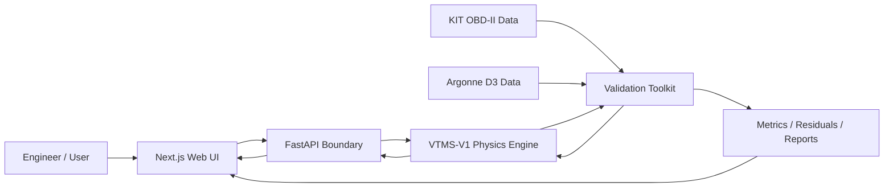

# VTMS

## Vehicle Thermal Management Simulation Platform

**VTMS-V1** is a physics-based automotive thermal-management simulation platform built around a deterministic Python/SciPy engineering model, numerical verification, controlled validation governance, a FastAPI execution boundary, and a responsive Next.js engineering interface.

> **Current classification:** Generic physics-based lumped-parameter transient thermal simulation. VTMS-V1 is numerically verified, remains generically parameterized and uncalibrated, is not an OEM vehicle model, and is not a synchronized digital twin.

## Live project

- Web application: `https://vtms.up.railway.app`
- API: `https://vtms-api.up.railway.app`
- Creator: Michael Palmer
- Local VTMS knowledge assistant: available in the web application with no external AI API

## Why this project exists

VTMS explores the intersection of automotive systems, mechanical engineering, scientific computing, validation practice, software engineering, and AI-assisted development. Calculated quantities must come from governing equations, sourced properties, measured inputs, calibrated parameters, or explicitly identified assumptions.

The project is built around three questions:

1. Can the frozen thermal model be implemented consistently and conserve energy numerically?
2. Can predictions be compared against independent physical evidence without contaminating the model through premature tuning?
3. Can a modern web application expose the engineering model without moving thermal calculations into the browser or overstating model maturity?

## Current status

| Area | Status |
|---|---|
| Physics specification | Complete, VTMS-V1 Engineering Model Specification 1.0.0 |
| Standalone Python engine | Complete |
| Numerical integration | SciPy `solve_ivp`, RK45 |
| Automated Python/API tests | **67 passing expected on this branch** |
| Engineering verification checks | **21 passing** |
| Canonical scenarios | S-01 through S-09 frozen and implemented |
| Energy-conservation verification | Passing |
| External KIT plausibility comparison | Complete, mismatch preserved without tuning |
| Controlled validation governance | Complete |
| Formal acceptance evaluator | Complete |
| Synthetic bounded-calibration harness | Complete, software-only evidence |
| Physical Argonne calibration bounds | **Frozen before Argonne residual inspection** |
| Broad synthetic identifiability preflight | Complete |
| Warm-up-stage practical-identifiability gate | **Complete, four-parameter CAL-01 blocked** |
| Argonne calibration role freeze | **Complete: CAL-01 plus CAL-RAD-01** |
| Argonne D3 data acquisition | **Complete, received 2026-08-17** |
| Argonne source fingerprinting | **Complete** |
| Argonne signal mapping and qualification | **In progress** |
| Argonne physical calibration | **Not started** |
| Argonne blind holdout validation | **Not started** |
| UI-5 visual productization | Complete |
| Creator / About page | Complete |
| Local VTMS knowledge assistant | Complete, no external AI service |
| Production dependency audit | Passing at high severity threshold |
| API and web container smoke tests | Passing |
| Vehicle-specific digital twin | Future maturity target |

## Architecture



The browser never calculates VTMS thermal physics. Simulation Lab sends a scenario request to FastAPI. The API validates and translates the request into the Python `Scenario` contract, invokes `SimulationRunner`, and returns the authoritative `SimulationResult`.

The validation layer remains separate from both FastAPI and the presentation layer. External data are normalized through explicit adapters and governed manifests before comparison with the frozen model.

## VTMS-V1 thermal model

VTMS-V1 has two transient state temperatures:

- `T_e`: effective engine-structure temperature
- `T_c`: bulk engine-side coolant temperature

Radiator outlet temperature is algebraic rather than a third integrated state.

```text
C_e dT_e/dt = Q_engine - Q_ec - Q_ea
C_c dT_c/dt = Q_ec - Q_rad

Q_ec = UA_ec (T_e - T_c)
Q_ea = UA_ea (T_e - T_a)
```

Radiator rejection uses a crossflow effectiveness-NTU formulation. Pump flow, thermostat and bypass behavior, fan airflow, ram airflow, radiator degradation, pump degradation, airflow degradation, and supported faults are deterministic component models.

Frozen V1 numerics:

- SciPy `solve_ivp`
- RK45
- relative tolerance `1e-6`
- absolute tolerance `1e-8`
- maximum internal step `1 s`
- approximately `1 s` output interval

## Verification

Verification asks whether the implementation solves the frozen VTMS-V1 equations consistently. It does not establish vehicle-specific physical accuracy.

CI covers Python 3.11, 3.12, and 3.13, the pre-Argonne identifiability preflight, web dependency audit, ESLint, TypeScript, web unit tests, Next.js production build, and API/web container smoke tests.

Coverage includes energy conservation, solver convergence, component invariants, canonical regression behavior, fault direction, API unit translation, validation hashing, evidence-role enforcement, calibration/holdout separation, formal acceptance decisions, synthetic bounded fitting, frozen physical-bound governance, staged calibration-bound subsets, Argonne mapping/provenance, and practical-identifiability regression protection.

## First external plausibility comparison

The first untouched external comparison used the KIT Automotive OBD-II Dataset. No VTMS parameters were changed.

Results:

- RMSE: **21.40 °C**
- MAE: **16.50 °C**
- mean bias: **+16.13 °C**
- 60 °C arrival: approximately **276 s early**
- 80 °C arrival: approximately **496 s early**
- final error after 1020 s: **-0.79 °C**

VTMS reached a similar final operating-temperature region but warmed substantially too quickly. The mismatch is preserved as evidence. This is **external plausibility evidence, not controlled physical validation**.

## Argonne D3 controlled data

Argonne National Laboratory supplied two 2012 Ford Focus D3 archives on **2026-08-17**. Both archives passed integrity checks and were SHA-256 fingerprinted.

The comprehensive archive contains **18 test files** with the channels needed for controlled thermal comparison, including:

- `Time [s]`
- `EngineCoolantTemp[C]`
- `Eng_Spd[RPM]`
- `Dyno_Spd[mph]`
- `Cell_Temp[C]`
- `Eng_FuelFlow_Direct[cc/s]`
- `MAF[g/s]`
- `Load[%]`

The source summary identifies the vehicle as a 2012 Ford Focus 2.0 L Ti-VCT GDI inline-four with a six-speed automatic transmission and 2WD configuration. It reports Tier II EEE HF437 fuel density of **0.743 g/mL** and net heating value of **18,344 BTU/lbm**, converted to **42,668,144 J/kg** when explicitly declared for controlled execution.

Raw Argonne attachments are not committed. The repository stores fingerprints, reviewed mappings, role decisions, and qualification findings.

Detailed qualification: [`docs/ARGONNE_D3_DATA_QUALIFICATION.md`](docs/ARGONNE_D3_DATA_QUALIFICATION.md)

## Frozen physical bounds

The complete governed physical bound set was frozen **before any VTMS-vs-Argonne residual inspection**:

| Parameter | Lower | Upper | Generic value |
|---|---:|---:|---:|
| `wall_heat_fraction` | 0.20 | 0.50 | 0.28 |
| `engine_thermal_capacitance_j_per_k` | 25,000 J/K | 100,000 J/K | 50,000 J/K |
| `engine_coolant_ua_w_per_k` | 400 W/K | 2,200 W/K | 1,000 W/K |
| `radiator_ua_nominal_w_per_k` | 400 W/K | 2,200 W/K | 1,100 W/K |

These are effective bounds for the frozen VTMS-V1 topology, not direct measurements of Ford component properties. The complete four-bound set is an audit record for the governed calibration universe. It does not authorize all four parameters to move in one optimizer stage.

See [`docs/ARGONNE_CALIBRATION_BOUNDS_AND_IDENTIFIABILITY.md`](docs/ARGONNE_CALIBRATION_BOUNDS_AND_IDENTIFIABILITY.md).

## Two identifiability questions

VTMS now performs two complementary synthetic checks before physical fitting.

The **broad excitation preflight** deliberately exercises warm-up, thermostat/radiator, speed, and fuel-rate regimes. It asks whether the model can produce locally distinct parameter signatures under rich excitation.

The **warm-up-stage diagnostic** reuses the existing synthetic calibration and holdout warm-up profiles. It asks whether all four parameters belong in one cold-start CAL-01 optimizer.

The combined warm-up profiles are numerically full-rank with a normalized-matrix condition number of approximately **8.12**, but radiator-UA RMS coolant sensitivity is only about **0.94% of the strongest parameter sensitivity**. The strongest combined sensitivity-shape relationship is wall heat fraction versus effective engine capacitance, cosine approximately **-0.88**.

The 2 percent weak-relative-sensitivity threshold is a VTMS engineering heuristic, not a formal statistical or validation criterion.

**Decision: a four-parameter simultaneous CAL-01 fit is prohibited.**

## Frozen staged calibration roles

Roles were selected from test documentation, measurement quality, source operating conditions, and synthetic pre-fit analysis before any Argonne model residual was inspected.

### CAL-01

Source: test `71207062`, UDDS #1 cold start.

Allowed fitted parameters:

- `wall_heat_fraction`, 0.20 to 0.50
- `engine_thermal_capacitance_j_per_k`, 25,000 to 100,000 J/K
- `engine_coolant_ua_w_per_k`, 400 to 2,200 W/K

`radiator_ua_nominal_w_per_k` is fixed during CAL-01.

The mapping starts after the invalid ECT initialization period and contains only explicitly reviewed source-time ECT exclusions. The adapter does not automatically repair ECT.

### CAL-RAD-01

Source: test `71207057`, 1.2 highway x2.

Allowed fitted parameter:

- `radiator_ua_nominal_w_per_k`, 400 to 2,200 W/K

This run was selected from source measurements before any VTMS prediction or residual inspection. From source time zero it has complete ECT at **91 to 99 °C**, mean dyno speed about **57.31 mph**, maximum speed **71.742 mph**, and about **92.65%** of samples at or above 40 mph while ECT is at or above 88 °C.

CAL-RAD-01 must use the frozen CAL-01 output snapshot for all non-radiator parameters. It may not reopen them.

### Holdouts

- **VAL-HOT-01:** test `71207063`, UDDS #2 hot start, primary clean independent holdout
- **VAL-SSS-01:** test `71207052`, 55 mph warm-up, secondary independent holdout
- **VAL-CS-01:** no separate clean cold-start UDDS replicate was identified
- **VAL-HWY-01:** test `71207065` is not qualified for full-cycle ECT validation
- **VAL-US06-01:** test `71207066` is not qualified for full-cycle ECT validation
- **CHALLENGE-IDLE-CS-01:** test `71207072` is challenge-only

The two existing holdouts were preserved when CAL-RAD-01 was introduced.

Machine-readable plan: [`validation_configs/argonne_validation_plan.json`](validation_configs/argonne_validation_plan.json)

## Controlled validation workflow

```text
Acquire    COMPLETE
   ↓
Hash       COMPLETE
   ↓
Bounds     COMPLETE / FROZEN
   ↓
Identify   COMPLETE
   ↓
Stage      COMPLETE
   ↓
Map        ACTIVE
   ↓
Calibrate  QUEUED
   ↓
Freeze     QUEUED
   ↓
Holdout    QUEUED
   ↓
Report     QUEUED
```

Before CAL-01 can run, VTMS must still freeze the exact normalized mapping/preprocessing hash, baseline parameter snapshot hash, and immutable three-parameter calibration manifest.

Before CAL-RAD-01 can run, VTMS must freeze the CAL-01 output snapshot, exact 71207057 preprocessing hash, and immutable radiator-only calibration manifest.

Only after both calibration stages are frozen may untouched holdouts be executed.

## Formal acceptance criteria

These are VTMS project criteria, not Argonne or SAE standards:

- RMSE <= 5 °C
- MAE <= 4 °C
- absolute mean bias <= 3 °C
- 90th percentile absolute error <= 7 °C
- 60/80/90 °C arrival-time error <= the larger of 60 s or 10% of measured arrival time

Numeric threshold success alone cannot create a formal validation claim. Formal pass additionally requires an independent holdout and `physical_evidence=true`.

## Current evidence statement

> **Argonne D3 controlled data have been acquired and fingerprinted. Physical calibration bounds and staged calibration roles are frozen before residual inspection. CAL-01 is a three-parameter cold-start warm-up stage and CAL-RAD-01 is a radiator-UA-only highway stage. Exact preprocessing/manifests are not yet frozen, controlled calibration has not started, and physical holdout validation has not been executed.**

VTMS-V1 therefore remains `numerical_verified_generic_uncalibrated`.

## Repository layout

```text
.
├── README.md
├── ARCHITECTURE.md
├── run_identifiability_preflight.py
├── docs/
│   ├── ARGONNE_D3_DATA_QUALIFICATION.md
│   ├── ARGONNE_CALIBRATION_BOUNDS_AND_IDENTIFIABILITY.md
│   ├── VALIDATION_GOVERNANCE.md
│   ├── SYNTHETIC_CALIBRATION_HARNESS.md
│   └── VTMS_V1_Physical_Validation_Protocol.docx
├── validation_configs/
│   ├── argonne_2012_focus_inventory.json
│   ├── argonne_2012_focus_71207062_calibration.json
│   ├── argonne_2012_focus_71207057_radiator_calibration.json
│   ├── argonne_2012_focus_71207063_holdout.json
│   └── argonne_validation_plan.json
├── src/
│   ├── vtms_v1/
│   ├── vtms_validation/
│   └── vtms_api/
├── tests/
├── tests_validation/
├── tests_api/
└── web/
```

## Engineering boundaries

VTMS-V1 intentionally does not model coolant pressure/boiling, two-phase flow, detailed coolant-jacket hydraulics, oil as a separate thermal state, heater-core extraction, cabin HVAC loads, A/C condenser coupling, transmission cooling, local cylinder-head hot spots, underhood CFD, OEM-specific control strategies, or live OBD-II/CAN synchronization.

High-temperature fault cases above the liquid-only caution boundary are treated qualitatively rather than as predictions of boiling or mechanical damage.

## Roadmap

### VTMS-V1

- [x] Freeze V1 physics specification
- [x] Implement standalone engine and component models
- [x] Add numerical verification and canonical regression tests
- [x] Build dataset-independent validation toolkit
- [x] Run untouched KIT plausibility comparison
- [x] Add controlled-validation manifests and evidence-role enforcement
- [x] Add formal acceptance evaluator
- [x] Add synthetic bounded-calibration and untouched-holdout harness
- [x] Deploy FastAPI and Next.js services
- [x] Complete UI-5 visual productization
- [x] Add creator page and local knowledge assistant
- [x] Receive and fingerprint Argonne D3 2012 Ford Focus data
- [x] Extend adapter for received TSV/direct-fuel schema
- [x] Freeze physical Argonne bounds before residual inspection
- [x] Add broad synthetic identifiability preflight
- [x] Add warm-up-stage practical-identifiability gate
- [x] Freeze CAL-01 to three warm-up-sensitive parameters
- [x] Preregister CAL-RAD-01 test 71207057 for radiator UA only
- [x] Preserve 71207063 and 71207052 as untouched holdouts
- [ ] Freeze exact CAL-01 preprocessing and immutable manifest
- [ ] Execute CAL-01 bounded calibration
- [ ] Freeze CAL-01 parameter snapshot
- [ ] Freeze exact CAL-RAD-01 preprocessing and immutable manifest
- [ ] Execute CAL-RAD-01 radiator-only calibration
- [ ] Freeze final staged parameter snapshot
- [ ] Execute untouched physical holdouts
- [ ] Publish controlled validation metrics, residuals, decisions, and limitations

### VTMS-V2

Vehicle-specific calibrated parameter sets, direct OBD-II/CAN replay, justified model extensions based on controlled residual analysis, and stronger uncertainty and sensitivity analysis.

### Future connected model / digital twin

Synchronized physical-vehicle telemetry, state estimation, continuous calibration, vehicle-specific prediction, and AI-assisted interpretation above the deterministic physics layer.

## Data attribution

The reduced KIT sample is derived from the **KIT Automotive OBD-II Dataset**, DOI `10.35097/1130`, licensed under CC BY 4.0.

Controlled Ford Focus data were supplied from the **Argonne National Laboratory Downloadable Dynamometer Database (D3)**. VTMS records and references that provenance. Raw Argonne attachments are not redistributed in this repository.

## License

Source code in this repository is released under the [MIT License](LICENSE). External datasets and derived samples remain subject to their source licenses and attribution requirements.
