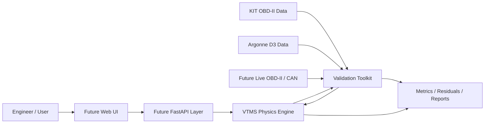

# VTMS

## Vehicle Thermal Management Simulation Platform

**VTMS-V1** is a physics-based automotive thermal-management simulation platform implemented in Python and SciPy. It models transient engine and coolant behavior, thermostat and bypass flow, pump behavior, vehicle-speed and fan airflow, and radiator heat rejection using a crossflow effectiveness-NTU formulation.

The project is intentionally built **engineering first**. The deterministic simulation core, numerical verification suite, and external validation tooling exist before any API, dashboard, AI layer, or digital-twin claim is introduced.

> **Current classification:** Generic physics-based lumped-parameter transient thermal simulation. VTMS-V1 is not an OEM-calibrated vehicle model and is not yet a synchronized digital twin.

## Why this project exists

VTMS was created to explore the intersection of mechanical engineering, automotive systems, scientific computing, and software engineering. The goal is not to produce another dashboard that displays invented values. The goal is to build a traceable engineering model where calculated quantities come from governing equations, sourced properties, measured inputs, calibrated parameters, or explicitly identified assumptions.

The current work centers on three questions:

1. Can the frozen thermal model be implemented consistently and conserve energy numerically?
2. Can the validation pipeline compare predictions against independent real-world telemetry without contaminating the model through premature tuning?
3. What model changes are justified only after controlled physical validation exposes a real deficiency?

## Current status

| Area | Status |
|---|---|
| Physics specification | Complete, VTMS-V1 Engineering Model Specification 1.0.0 |
| Standalone Python engine | Complete |
| Numerical integration | SciPy `solve_ivp`, RK45 |
| Full engine + validation tests | **22 passing** |
| Engineering verification checks | **21 passing** |
| Canonical fault/scenario suite | S-01 through S-09 implemented |
| Energy-conservation verification | Passing |
| External real-world plausibility test | Complete using KIT OBD-II telemetry |
| Controlled physical validation | Pending Argonne D3 raw data |
| FastAPI / web UI | Deferred until validation progresses |
| Vehicle-specific digital twin | Future maturity target |

## Architecture



The current repository implements the **physics engine** and **validation toolkit**. The future API and UI will consume the Python engineering core rather than reimplementing physics in the frontend.

For the complete technical map, see [`ARCHITECTURE.md`](ARCHITECTURE.md).

## VTMS-V1 thermal model

VTMS-V1 freezes two transient state temperatures:

- `T_e`: effective engine-structure temperature
- `T_c`: bulk engine-side coolant temperature

Radiator outlet temperature is derived algebraically rather than treated as a third ODE state. This avoids double-counting radiator thermal storage in the V1 lumped model.

The core balances are:

```text
C_e dT_e/dt = Q_engine - Q_ec - Q_ea
C_c dT_c/dt = Q_ec - Q_rad
```

with:

```text
Q_ec = UA_ec (T_e - T_c)
Q_ea = UA_ea (T_e - T_a)
```

Radiator heat rejection is calculated with a crossflow effectiveness-NTU model. Coolant circulation, thermostat/bypass behavior, fan airflow, ram airflow, radiator degradation, pump degradation, and component faults are separate deterministic model components.

## Repository layout

```text
.
├── README.md
├── ARCHITECTURE.md
├── IMPLEMENTATION_AUDIT.md
├── VERIFICATION_RESULTS.md
├── KIT_DATASET_AUDIT.md
├── VALIDATION_TOOLKIT_README.md
├── pyproject.toml
├── docs/
│   ├── VTMS_V1_Engineering_Model_Specification.docx
│   ├── VTMS_V1_Physical_Validation_Protocol.docx
│   └── images/
├── example_run.py
├── run_verification.py
├── run_kit_plausibility.py
├── src/
│   ├── vtms_v1/
│   └── vtms_validation/
├── tests/
├── tests_validation/
├── validation_data/
└── validation_outputs/
```

## Verification

Verification answers a software and mathematics question:

> Does the implementation solve the frozen VTMS-V1 equations consistently?

The automated verification work includes numerical energy conservation, solver convergence, component invariants, zero-flow safeguards, fault-direction behavior, metadata and parameter provenance, and regression checks against all nine canonical scenarios.

See [`VERIFICATION_RESULTS.md`](VERIFICATION_RESULTS.md) and [`IMPLEMENTATION_AUDIT.md`](IMPLEMENTATION_AUDIT.md).

## Real-world plausibility testing

The validation layer is intentionally separate from the physics engine. External sources are normalized into a common `ValidationDataset` contract containing time, measured coolant temperature, engine RPM, vehicle speed, ambient temperature, and optional fuel or airflow signals.

The first external comparison used a real KIT Seat Leon OBD-II warm-up trace. **No VTMS parameters were changed for the comparison.**

The result exposed an important transient-model question:

- RMSE: **21.40 °C**
- MAE: **16.50 °C**
- mean bias: **+16.13 °C**
- 60 °C arrival: approximately **276 seconds early**
- 80 °C arrival: approximately **496 seconds early**
- final error after 1020 seconds: **-0.79 °C**

VTMS reaches a similar final operating-temperature region but warms substantially too quickly relative to this trace. The model was deliberately **not recalibrated** in response.

### Measured versus predicted coolant temperature


### Prediction residual


This is classified as an **external plausibility check**, not formal vehicle validation. See [`KIT_DATASET_AUDIT.md`](KIT_DATASET_AUDIT.md) and [`validation_outputs/FIRST_COMPARISON_FINDINGS.md`](validation_outputs/FIRST_COMPARISON_FINDINGS.md).

## Physical validation strategy

Formal V1 validation is designed around controlled Argonne National Laboratory D3 dynamometer data.

The preregistered process is:

1. Obtain qualified 72 °F conventional gasoline vehicle runs and the associated channel dictionary.
2. Select one calibration run.
3. Permanently reserve separate runs as untouched holdouts.
4. Calibrate only the preregistered uncertain parameters.
5. Freeze the calibration.
6. Run holdout predictions without using measured coolant temperature after initialization.
7. Report RMSE, MAE, bias, P90 error, maximum error, warm-up threshold timing, residuals, and limitations.

The Argonne adapter currently refuses to guess the raw D3 schema. It will be implemented only after the official channel names and units are available.

The formal preregistered process is documented in [`docs/VTMS_V1_Physical_Validation_Protocol.docx`](docs/VTMS_V1_Physical_Validation_Protocol.docx).

## Installation

Requires **Python 3.11+**.

```text
python -m pip install -e ".[dev]"
```

Run the full automated suite:

```text
python -m pytest
```

Run the engineering verification report:

```text
python run_verification.py
```

Run the included KIT plausibility comparison:

```text
python run_kit_plausibility.py
```

## Example

```python
from vtms_v1.scenarios import canonical_scenarios
from vtms_v1.simulation import SimulationRunner

scenario = canonical_scenarios()["S-01"]
result = SimulationRunner().run(scenario)

print(result.model_metadata)
print(result.energy_balance)
print(result.time_series[-1])
```

## Engineering boundaries

VTMS-V1 intentionally does not model coolant pressure or boiling, two-phase flow, detailed coolant-jacket hydraulics, oil thermal behavior, heater-core heat extraction, cabin HVAC loads, A/C condenser coupling, transmission cooling, local cylinder-head hot spots, underhood CFD, OEM-specific control strategies, live OBD-II/CAN synchronization, or AI-generated thermal calculations.

High-temperature fault cases that exceed the liquid-only caution boundary are therefore treated qualitatively rather than as predictions of damage or boiling behavior.

## Roadmap

### VTMS-V1

- [x] Freeze engineering model specification
- [x] Implement standalone Python physics engine
- [x] Implement component and fault models
- [x] Add automated verification and regression tests
- [x] Build dataset-independent validation toolkit
- [x] Run first untouched real-world plausibility comparison
- [ ] Complete Argonne D3 calibration and blind holdout validation
- [ ] Publish formal validation results

### VTMS-V2

Vehicle-specific calibrated parameter sets, direct OBD-II/CAN replay, justified model extensions based on residual analysis, and stronger uncertainty and sensitivity analysis.

### Future connected model / digital twin

Synchronized physical-vehicle telemetry, state estimation, continuous calibration, vehicle-specific prediction, and AI-assisted interpretation above the deterministic physics layer.

## Documentation

- [`ARCHITECTURE.md`](ARCHITECTURE.md): complete software and engineering architecture
- [`docs/VTMS_V1_Engineering_Model_Specification.docx`](docs/VTMS_V1_Engineering_Model_Specification.docx): frozen V1 physics and implementation contract
- [`docs/VTMS_V1_Physical_Validation_Protocol.docx`](docs/VTMS_V1_Physical_Validation_Protocol.docx): preregistered calibration and holdout validation plan
- [`IMPLEMENTATION_AUDIT.md`](IMPLEMENTATION_AUDIT.md): implementation decisions and specification gaps
- [`VERIFICATION_RESULTS.md`](VERIFICATION_RESULTS.md): numerical verification results
- [`KIT_DATASET_AUDIT.md`](KIT_DATASET_AUDIT.md): external dataset qualification and limitations
- [`VALIDATION_TOOLKIT_README.md`](VALIDATION_TOOLKIT_README.md): validation package operation

## Data attribution

The reduced KIT sample in this repository is derived from the **KIT Automotive OBD-II Dataset**, DOI `10.35097/1130`, licensed under **CC BY 4.0**. It is included only as a small external plausibility case.

## License

Source code in this repository is released under the [MIT License](LICENSE). External datasets and derived samples remain subject to their respective source licenses and attribution requirements.