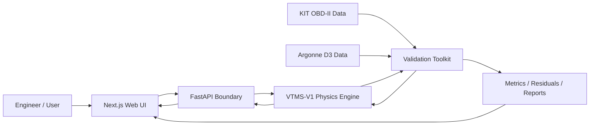

# VTMS

## Vehicle Thermal Management Simulation Platform

**VTMS-V1** is a physics-based automotive thermal-management simulation platform built around a deterministic Python/SciPy engineering model, numerical verification, controlled validation governance, a FastAPI execution boundary, and a responsive Next.js engineering interface.

> **Current classification:** Generic physics-based lumped-parameter transient thermal simulation. VTMS-V1 is numerically verified, remains generically parameterized and uncalibrated, is not an OEM vehicle model, and is not a synchronized digital twin.

## Live project

- Web application: `https://vtms.up.railway.app`
- API: `https://vtms-api.up.railway.app`
- Creator: Michael Palmer
- Local VTMS knowledge assistant: available in the web application with no external AI API

## Why this project exists

VTMS explores the intersection of automotive systems, mechanical engineering, scientific computing, validation practice, software engineering, and AI-assisted development. Calculated quantities must come from governing equations, sourced properties, measured inputs, calibrated parameters, or explicitly identified assumptions.

The project is built around three questions:

1. Can the frozen thermal model be implemented consistently and conserve energy numerically?
2. Can predictions be compared against independent physical evidence without contaminating the model through premature tuning?
3. Can a modern web application expose the engineering model without moving thermal calculations into the browser or overstating model maturity?

## Current status

| Area | Status |
|---|---|
| Physics specification | Complete, VTMS-V1 Engineering Model Specification 1.0.0 |
| Standalone Python engine | Complete |
| Numerical integration | SciPy `solve_ivp`, RK45 |
| Automated Python/API tests | **65 passing** |
| Engineering verification checks | **21 passing** |
| Canonical scenarios | S-01 through S-09 frozen and implemented |
| Energy-conservation verification | Passing |
| External KIT plausibility comparison | Complete, mismatch preserved without tuning |
| Controlled validation governance | Complete |
| Formal acceptance evaluator | Complete |
| Synthetic bounded-calibration harness | Complete, software-only evidence |
| Pre-Argonne identifiability gate | **Complete, staged calibration required** |
| Argonne calibration role freeze | **Complete: CAL-01 plus CAL-RAD-01** |
| Argonne D3 data acquisition | **Complete, received 2026-08-17** |
| Argonne source fingerprinting | **Complete** |
| Argonne signal mapping and qualification | **In progress** |
| Argonne physical calibration | **Not started** |
| Argonne blind holdout validation | **Not started** |
| Physical calibration bounds | **Unresolved, must be justified and frozen before fitting** |
| UI-5 visual productization | Complete |
| Creator / About page | Complete |
| Local VTMS knowledge assistant | Complete, no external AI service |
| Production dependency audit | Passing at high severity threshold |
| API and web container smoke tests | Passing |
| Vehicle-specific digital twin | Future maturity target |

## Architecture



The browser never calculates VTMS thermal physics. Simulation Lab sends a scenario request to FastAPI. The API validates and translates the request into the Python `Scenario` contract, invokes `SimulationRunner`, and returns the authoritative `SimulationResult`.

The validation layer remains separate from both the FastAPI transport boundary and the presentation layer. External data are normalized through explicit adapters and governed manifests before comparison with the frozen model.

## VTMS-V1 thermal model

VTMS-V1 has two transient state temperatures:

- `T_e`: effective engine-structure temperature
- `T_c`: bulk engine-side coolant temperature

Radiator outlet temperature is algebraic rather than a third integrated state.

```text
C_e dT_e/dt = Q_engine - Q_ec - Q_ea
C_c dT_c/dt = Q_ec - Q_rad

Q_ec = UA_ec (T_e - T_c)
Q_ea = UA_ea (T_e - T_a)
```

Radiator rejection uses a crossflow effectiveness-NTU formulation. Pump flow, thermostat and bypass behavior, fan airflow, ram airflow, radiator degradation, pump degradation, airflow degradation, and supported faults are deterministic component models.

Numerics are frozen for V1:

- SciPy `solve_ivp`
- RK45
- relative tolerance `1e-6`
- absolute tolerance `1e-8`
- maximum internal step `1 s`
- approximately `1 s` output interval

## Verification

Verification asks whether the implementation solves the frozen VTMS-V1 equations consistently. It does not establish vehicle-specific physical accuracy.

The repository now has **65 passing Python/API tests** and **21 passing engineering verification checks**. CI runs the Python suite on Python 3.11, 3.12, and 3.13, plus the synthetic identifiability diagnostic, web dependency audit, ESLint, TypeScript, web unit tests, Next.js production build, and API/web container smoke tests.

Verification coverage includes:

- energy conservation
- solver convergence
- component invariants
- canonical scenario regression behavior
- fault direction
- API boundary and unit translation
- validation dataset hashing
- evidence-role enforcement
- calibration/holdout separation
- formal acceptance decisions
- synthetic bounded fitting and untouched holdout execution
- synthetic pre-fit identifiability and weak-excitation detection
- staged Argonne calibration-role regression protection
- Argonne TSV mapping, direct fuel-flow normalization, source-time selection, and preprocessing provenance

## First external plausibility comparison

The first untouched external comparison used the KIT Automotive OBD-II Dataset. No VTMS parameters were changed.

Results:

- RMSE: **21.40 °C**
- MAE: **16.50 °C**
- mean bias: **+16.13 °C**
- 60 °C arrival: approximately **276 s early**
- 80 °C arrival: approximately **496 s early**
- final error after 1020 s: **-0.79 °C**

VTMS reached a similar final operating-temperature region but warmed substantially too quickly. That mismatch is preserved as evidence.

This is **external plausibility evidence, not controlled physical validation**.

## Argonne D3 controlled-data qualification

Argonne National Laboratory supplied two 2012 Ford Focus D3 archives to the project on **2026-08-17**. Both archives passed ZIP integrity checks and were SHA-256 fingerprinted before analysis.

The comprehensive archive contains **18 test files** with the channels required for controlled thermal comparison, including:

- `Time [s]`
- `EngineCoolantTemp[C]`
- `Eng_Spd[RPM]`
- `Dyno_Spd[mph]`
- `Cell_Temp[C]`
- `Eng_FuelFlow_Direct[cc/s]`
- `MAF[g/s]`
- `Load[%]`

The received master summary identifies the vehicle as a 2012 Ford Focus 2.0 L Ti-VCT GDI inline-four with a six-speed automatic transmission and 2WD configuration.

The master summary reports Tier II EEE HF437 fuel with:

- density: **0.743 g/mL**
- net heating value: **18,344 BTU/lbm**, converted to **42,668,144 J/kg** when explicitly declared for controlled execution

The raw Argonne attachments are **not committed to this repository**. The repository stores their fingerprints, test-file fingerprints, reviewed mappings, qualification findings, and role reservations. This avoids redistributing Argonne-supplied attachments without an explicit redistribution determination.

Detailed qualification record: [`docs/ARGONNE_D3_DATA_QUALIFICATION.md`](docs/ARGONNE_D3_DATA_QUALIFICATION.md)

Machine-readable inventory: [`validation_configs/argonne_2012_focus_inventory.json`](validation_configs/argonne_2012_focus_inventory.json)

## Reviewed Argonne mapping

The received comprehensive files are tab-separated text. `ArgonneD3Adapter` supports explicitly mapped CSV, TSV, and delimited text while continuing to refuse schema guessing.

Reviewed mapping:

| VTMS signal | Argonne source | Source unit |
|---|---|---|
| time | `Time [s]` | s |
| measured coolant temperature | `EngineCoolantTemp[C]` | C |
| engine speed | `Eng_Spd[RPM]` | rpm |
| vehicle speed | `Dyno_Spd[mph]` | mph |
| ambient/test-cell temperature | `Cell_Temp[C]` | C |
| direct fuel rate | `Eng_FuelFlow_Direct[cc/s]` | cc/s |

Direct fuel flow is converted to `kg/s` only when the documented fuel density is explicitly present in the signal map. The controlled runner still requires an explicit positive lower heating value before converting fuel mass rate to fuel energy.

The KIT MAF stoichiometric proxy is prohibited as formal controlled heat-input evidence. The received Argonne MAF channel also contains impossible spikes in several tests, reinforcing the decision to use direct fuel evidence instead.

## Frozen Argonne role decisions

Run roles were selected from Argonne test documentation, measurement quality, and source operating conditions **before inspecting any VTMS residuals**.

- **CAL-01:** test `71207062`, UDDS #1 cold start. Fitted subset is frozen to `wall_heat_fraction`, `engine_thermal_capacitance_j_per_k`, and `engine_coolant_ua_w_per_k`.
- **CAL-RAD-01:** test `71207057`, 1.2 highway x2. Reserved for `radiator_ua_nominal_w_per_k` only after the CAL-01 snapshot is frozen.
- **VAL-HOT-01:** test `71207063`, UDDS #2 hot start. Reserved as the primary clean independent holdout candidate.
- **VAL-SSS-01:** test `71207052`, 55 mph warm-up. Reserved as a secondary independent holdout candidate.
- **VAL-CS-01:** no separate clean cold-start UDDS replicate was identified in the received package.
- **VAL-HWY-01:** test `71207065` is not qualified for full-cycle ECT validation because usable ECT ends at approximately 223 s.
- **VAL-US06-01:** test `71207066` is not qualified for full-cycle ECT validation because usable ECT ends at approximately 481 s.
- **CHALLENGE-IDLE-CS-01:** test `71207072`, cold-start idle/no-fan, is challenge-only because ECT coverage is partial.

The cold-start calibration mapping explicitly starts after an invalid ECT initialization period and excludes only reviewed source-time ECT dropouts. The adapter does not automatically detect or repair ECT.

## Pre-fit practical identifiability

Before allowing physical calibration, VTMS applies a synthetic-only local sensitivity gate to the four governance-approved calibration parameters. The diagnostic rejects physical datasets, so it cannot inspect Argonne prediction residuals during this pre-bound phase.

The combined synthetic profiles produced:

- numerical rank: **4 of 4**
- normalized sensitivity-matrix condition number: **8.12**
- strongest pairwise sensitivity-shape similarity: wall heat fraction versus effective engine thermal capacitance, `cosine = -0.88`
- radiator-UA RMS coolant sensitivity: **0.94% of the strongest parameter sensitivity**

The matrix is mathematically full-rank, but radiator `UA` is too weakly excited by the warm-up profiles to justify a four-parameter simultaneous CAL-01 fit.

The source-only follow-up review selected test 71207057 for a separate radiator stage. From source time zero, it has complete ECT at **91 to 99 °C**, average dyno speed about **57.31 mph**, maximum speed **71.742 mph**, and about **92.65%** of samples at or above 40 mph while ECT is at or above 88 °C. No VTMS prediction or residual was inspected before assigning `CAL-RAD-01`.

Detailed readiness record: [`docs/PRE_ARGONNE_CALIBRATION_READINESS.md`](docs/PRE_ARGONNE_CALIBRATION_READINESS.md)

## Controlled validation workflow

Current progress:

```text
Acquire    COMPLETE
   ↓
Hash       COMPLETE
   ↓
Map        ACTIVE
   ↓
Identify   COMPLETE
   ↓
Stage      COMPLETE
   ↓
Bound      QUEUED
   ↓
Calibrate  QUEUED
   ↓
Freeze     QUEUED
   ↓
Holdout    QUEUED
   ↓
Report     QUEUED
```

Before CAL-01 can run, VTMS must still:

1. establish physically justified bounds for its three fitted parameters,
2. freeze those bounds before observing Argonne fit residuals,
3. finalize the CAL-01 normalized mapping and preprocessing hash,
4. create the immutable CAL-01 manifest,
5. only then execute bounded calibration.

Before CAL-RAD-01 can run, VTMS must additionally freeze the CAL-01 output snapshot, establish and freeze the radiator-UA bound, freeze the 71207057 mapping hash, and create a radiator-only immutable calibration manifest. CAL-RAD-01 may not reopen the three CAL-01 parameters.

Synthetic demonstration bounds are test fixtures only and are not approved Argonne bounds.

## Formal acceptance criteria

These are VTMS project criteria, not Argonne or SAE standards:

- RMSE <= 5 °C
- MAE <= 4 °C
- absolute mean bias <= 3 °C
- 90th percentile absolute error <= 7 °C
- 60/80/90 °C arrival-time error <= the larger of 60 s or 10% of measured arrival time

Numeric threshold success alone cannot create a formal validation claim. Formal pass additionally requires an independent holdout and `physical_evidence=true`.

## Current evidence statement

The correct current statement is:

> **Argonne D3 controlled data have been acquired and fingerprinted. Signal qualification is in progress. The synthetic pre-fit identifiability gate and staged calibration-role freeze are complete. CAL-01 is a three-parameter warm-up calibration candidate and CAL-RAD-01 is radiator-UA only. Physical bounds are not frozen, controlled calibration has not started, and physical holdout validation has not been executed.**

VTMS-V1 therefore remains `numerical_verified_generic_uncalibrated`.

## Repository layout

```text
.
├── README.md
├── ARCHITECTURE.md
├── IMPLEMENTATION_AUDIT.md
├── VERIFICATION_RESULTS.md
├── KIT_DATASET_AUDIT.md
├── VALIDATION_TOOLKIT_README.md
├── run_synthetic_identifiability.py
├── docs/
│   ├── ARGONNE_D3_DATA_QUALIFICATION.md
│   ├── PRE_ARGONNE_CALIBRATION_READINESS.md
│   ├── VALIDATION_GOVERNANCE.md
│   ├── SYNTHETIC_CALIBRATION_HARNESS.md
│   ├── DEPLOYMENT.md
│   └── VTMS_V1_Physical_Validation_Protocol.docx
├── validation_configs/
│   ├── argonne_2012_focus_inventory.json
│   ├── argonne_2012_focus_71207062_calibration.json
│   ├── argonne_2012_focus_71207057_radiator_calibration.json
│   ├── argonne_2012_focus_71207063_holdout.json
│   └── argonne_validation_plan.json
├── src/
│   ├── vtms_v1/
│   ├── vtms_validation/
│   └── vtms_api/
├── tests/
├── tests_validation/
├── tests_api/
└── web/
```

## Engineering boundaries

VTMS-V1 intentionally does not model:

- coolant pressure or boiling
- two-phase flow
- detailed coolant-jacket hydraulics
- oil thermal behavior as a separate state
- heater-core extraction
- cabin HVAC loads
- A/C condenser coupling
- transmission cooling
- local cylinder-head hot spots
- underhood CFD
- OEM-specific control strategies
- live OBD-II/CAN synchronization
- AI-generated thermal calculations

High-temperature fault cases above the liquid-only caution boundary are treated qualitatively rather than as predictions of boiling or mechanical damage.

## Roadmap

### VTMS-V1

- [x] Freeze V1 physics specification
- [x] Implement standalone engine and component models
- [x] Add numerical verification and canonical regression tests
- [x] Build dataset-independent validation toolkit
- [x] Run untouched KIT plausibility comparison
- [x] Add controlled-validation manifests and evidence-role enforcement
- [x] Add formal acceptance evaluator
- [x] Add synthetic bounded-calibration and untouched-holdout harness
- [x] Deploy FastAPI and Next.js services
- [x] Complete UI-5 visual productization
- [x] Add creator page and local knowledge assistant
- [x] Receive Argonne D3 2012 Ford Focus controlled-data package
- [x] Fingerprint received Argonne archives and comprehensive test files
- [x] Register candidate calibration and holdout roles before fitting
- [x] Extend the adapter for the received TSV/direct-fuel schema
- [x] Add synthetic-only pre-fit practical-identifiability gate
- [x] Freeze CAL-01 to the three warm-up-sensitive parameters
- [x] Preregister CAL-RAD-01 test 71207057 for radiator UA only
- [x] Preserve 71207063 and 71207052 as untouched holdouts
- [ ] Complete and freeze source-signal qualification/preprocessing
- [ ] Establish physically justified Argonne calibration bounds before fitting
- [ ] Execute CAL-01 bounded calibration
- [ ] Freeze the CAL-01 parameter snapshot
- [ ] Execute CAL-RAD-01 radiator-only calibration
- [ ] Freeze the final staged parameter snapshot
- [ ] Execute untouched physical holdouts
- [ ] Publish controlled validation metrics, residuals, decisions, and limitations

### VTMS-V2

Vehicle-specific calibrated parameter sets, direct OBD-II/CAN replay, justified model extensions based on controlled residual analysis, and stronger uncertainty and sensitivity analysis.

### Future connected model / digital twin

Synchronized physical-vehicle telemetry, state estimation, continuous calibration, vehicle-specific prediction, and AI-assisted interpretation above the deterministic physics layer.

## Documentation

- [`ARCHITECTURE.md`](ARCHITECTURE.md): engineering and software architecture
- [`docs/ARGONNE_D3_DATA_QUALIFICATION.md`](docs/ARGONNE_D3_DATA_QUALIFICATION.md): received Argonne data inventory, mapping, QC, and role decisions
- [`docs/PRE_ARGONNE_CALIBRATION_READINESS.md`](docs/PRE_ARGONNE_CALIBRATION_READINESS.md): pre-fit parameter-separation analysis and staged calibration decision
- [`docs/VALIDATION_GOVERNANCE.md`](docs/VALIDATION_GOVERNANCE.md): controlled evidence roles, provenance locks, and staged-fit governance
- [`docs/SYNTHETIC_CALIBRATION_HARNESS.md`](docs/SYNTHETIC_CALIBRATION_HARNESS.md): nonphysical calibration/freeze/holdout dry run
- [`docs/DEPLOYMENT.md`](docs/DEPLOYMENT.md): Railway topology and production verification
- [`docs/VTMS_V1_Engineering_Model_Specification.docx`](docs/VTMS_V1_Engineering_Model_Specification.docx): frozen V1 physics contract
- [`docs/VTMS_V1_Physical_Validation_Protocol.docx`](docs/VTMS_V1_Physical_Validation_Protocol.docx): physical validation protocol
- [`VALIDATION_TOOLKIT_README.md`](VALIDATION_TOOLKIT_README.md): validation package operation

## Data attribution

The reduced KIT sample in this repository is derived from the **KIT Automotive OBD-II Dataset**, DOI `10.35097/1130`, licensed under CC BY 4.0.

Controlled Ford Focus data were supplied from the **Argonne National Laboratory Downloadable Dynamometer Database (D3)**. VTMS records and references that provenance in the qualification documentation and will reference the Argonne dataset in any published work that uses it. Raw Argonne attachments are not redistributed in this repository.

## License

Source code in this repository is released under the [MIT License](LICENSE). External datasets and derived samples remain subject to their respective source licenses and attribution requirements.
