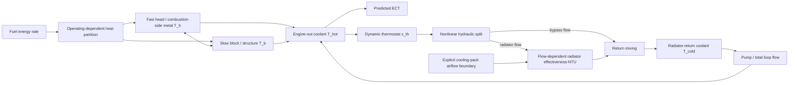

# VTMS-V2 Model-Form Revision Specification

## Status

**Proposed engineering specification. Not frozen. Not yet implemented.**

This document defines the minimum model-form revision proposed for VTMS-V2 based on the preserved VTMS-V1 calibration and independent holdout evidence.

VTMS-V2 is not a retuning of VTMS-V1. It is a governed model revision intended to address structural deficiencies exposed by V1 residuals, parameter-bound behavior, and failed independent validation.

No V1 holdout may be relabeled as blind V2 validation evidence. Previously observed V1 calibration and holdout runs may be used as V2 development evidence only.

---

## 1. Purpose

VTMS-V1 answered an important engineering question: a deterministic two-state engine/coolant model can be implemented consistently and numerically verified, but the frozen V1 topology cannot reproduce independent physical Ford Focus coolant-temperature behavior within the project's preregistered acceptance criteria.

The purpose of VTMS-V2 is therefore not to make the existing equations fit harder. The purpose is to introduce only those additional physical states and control relationships that are justified by the V1 evidence.

The V2 design shall satisfy five principles:

1. Every added state or subsystem must trace to a documented V1 limitation or residual pattern.
2. V2 must remain low-order, deterministic, auditable, and computationally lightweight.
3. Additional parameters must not be introduced unless they can be constrained by physical evidence, independent observables, or strong preregistered bounds.
4. Previously observed Argonne holdouts may guide model development but may not be reused as clean blind validation evidence.
5. V2 must preserve the separation between numerical verification, calibration evidence, physical validation, and product presentation.

---

## 2. V1 evidence driving the revision

### 2.1 CAL-01 boundary behavior

The controlled cold-start calibration fitted three V1 parameters:

- `wall_heat_fraction` = 0.4999228433, within 1 percent of the frozen upper bound 0.50
- `engine_thermal_capacitance_j_per_k` = 52393.9078 J/K
- `engine_coolant_ua_w_per_k` = 2198.4326 W/K, within 1 percent of the frozen upper bound 2200 W/K

CAL-01 achieved:

- RMSE = 3.716 degC
- MAE = 3.285 degC
- mean bias = -2.414 degC
- final error = -4.631 degC

Interpretation: the two-state model can reproduce a cold-start trace only by demanding nearly maximum permitted heat input to the engine structure and nearly maximum permitted coupling from engine structure to coolant. This is evidence that the fitted V1 parameters are compensating for omitted thermal structure.

Source record: `validation_outputs/ARGONNE_CAL_01_FORMAL_RESULT.json`.

### 2.2 CAL-RAD-01 boundary behavior

With the CAL-01 parameters frozen, the radiator-active calibration fitted only radiator UA:

- `radiator_ua_nominal_w_per_k` = 400.8325 W/K, within 1 percent of the frozen lower bound 400 W/K

Despite driving radiator conductance nearly to the minimum permitted value, the model remained too cold:

- RMSE = 5.733 degC
- MAE = 5.344 degC
- mean bias = -5.272 degC
- final measured coolant = 99.0 degC
- final predicted coolant = 93.876 degC
- final error = -5.124 degC

Interpretation: the V1 structure first requires nearly maximum engine heating/coupling and then nearly minimum radiator conductance, yet still underpredicts hot coolant temperature. A single constant radiator UA cannot reconcile the model across operating regimes.

Source record: `validation_outputs/ARGONNE_CAL_RAD_01_FORMAL_RESULT.json`.

### 2.3 VAL-HOT-01 primary holdout failure

The first blind hot-start holdout produced:

- RMSE = 8.587 degC
- MAE = 8.069 degC
- mean bias = -8.037 degC
- P90 absolute error = 10.051 degC
- final measured coolant = 99.0 degC
- final predicted coolant = 90.473 degC
- final error = -8.527 degC
- 90 degC arrival = 125.6 s late

Approximately 87.6 percent of the mean-squared error is explained by the mean bias alone. The error is therefore dominated by a systematic thermal-state offset rather than isolated noise.

Source record: `validation_outputs/ARGONNE_VAL_HOT_01_FORMAL_RESULT.json`.

### 2.4 VAL-SSS-01 secondary holdout failure

The independent 55 mph warm-up holdout produced:

- RMSE = 5.126 degC
- MAE = 4.109 degC
- mean bias = -4.015 degC
- final measured coolant = 99.0 degC
- final predicted coolant = 90.577 degC
- final error = -8.423 degC
- 80 degC arrival error = 17.3 s, pass
- 90 degC arrival error = 23.8 s, pass

This result is especially diagnostic. V1 reaches 80 degC and 90 degC at approximately the correct times, then settles far below the measured regulated temperature. That pattern cannot be explained by thermal capacitance alone. It points directly at the hot-region coolant topology and control/rejection model.

Source record: `validation_outputs/ARGONNE_VAL_SSS_01_CONFIRMATORY_RESULT.json`.

### 2.5 KIT external plausibility evidence

The untouched generic V1 model warmed much faster than the independent KIT road trace:

- 60 degC arrival approximately 276 s early
- 80 degC arrival approximately 496 s early
- final error after 1020 s only -0.79 degC

Interpretation: V1 can approach a plausible long-run operating region while carrying the wrong transient thermal storage and distribution. This supports introducing more than one engine-structure time constant.

Source record: `validation_outputs/FIRST_COMPARISON_FINDINGS.md`.

---

## 3. V1 structural deficiencies

The following limitations are considered directly supported by the preserved V1 evidence.

### D-01: one coolant state is insufficient

VTMS-V1 uses one bulk coolant state, `T_c`, as the engine-side coolant temperature, thermostat sensing temperature, radiator inlet temperature, system thermal state, and comparison target against measured ECT.

A physical cooling circuit has spatial temperature structure. Engine-out coolant and radiator-return coolant are not the same state. An ECT sensor measures coolant at a local engine-side position, not the mass-weighted average temperature of the entire cooling system.

The persistent 5 to 9 degC hot-region underprediction after approximately correct 80/90 degC arrival strongly supports separating engine-out/hot-side coolant from radiator-return/cold-side coolant.

### D-02: thermostat behavior is over-simplified

VTMS-V1 thermostat opening is an instantaneous linear function of the single coolant state between fixed open and full-open temperatures. The model contains no thermostat thermal response, lag, hysteresis, or local sensing distinction.

The V1 failure becomes strongest in the regulated hot region where thermostat and radiator behavior dominate the equilibrium. A dynamic thermostat state is therefore justified.

### D-03: valve opening is incorrectly equivalent to radiator flow fraction

VTMS-V1 defines:

`m_dot_rad = alpha * m_dot_pump`

`m_dot_bypass = (1 - alpha) * m_dot_pump`

where `alpha` is thermostat opening.

Real branch flow division is determined by valve flow area and competing hydraulic resistances, not by a direct identity between normalized valve position and normalized mass-flow fraction.

V2 must break this identity.

### D-04: radiator conductance is too static

VTMS-V1 uses a crossflow effectiveness-NTU formulation with a constant nominal UA. Air and coolant capacity rates vary, but the conductance itself does not respond to operating flow.

The CAL-RAD-01 boundary result and independent hot-region underprediction support a flow-dependent heat-rejection model.

### D-05: dyno speed is not radiator face velocity

The controlled-data adapter maps Argonne `Dyno_Spd[mph]` into the V1 vehicle-speed boundary, and the airflow model converts that speed directly into ram airflow.

This is an admissible V1 simplification but not an adequate V2 validation boundary. Chassis-dyno roller speed and radiator-core air velocity are distinct physical quantities even when a test-cell fan is speed matched.

V2 must make cooling-pack airflow an explicit boundary condition or a separately calibrated/provenanced transform.

### D-06: one engine structural temperature is insufficient

VTMS-V1 collapses combustion-facing metal, cylinder head, block, oil-coupled structure, and other participating solids into one effective engine temperature and one effective capacitance.

The KIT transient mismatch and CAL-01 boundary behavior support at least two engine structural time scales.

### D-07: constant fuel-to-coolant heat partition is insufficient

Controlled V1 comparisons calculate engine heat as direct fuel-energy rate multiplied by one constant `wall_heat_fraction`.

The Argonne data provide direct fuel flow plus engine speed and load, but V1 does not allow the coolant-relevant heat fraction to vary with operating condition or thermal state.

V2 must retain the measured fuel-energy boundary while allowing a low-order, bounded operating-dependent heat partition.

### D-08: hot-start hidden-state initialization is inadequate

V1 initializes the unmeasured engine structural state equal to the first measured coolant temperature unless manually overridden.

That is physically restrictive for hot starts and preconditioned tests because engine solids may retain thermal energy that is not represented by the instantaneous coolant measurement.

V2 must support state-aware initialization.

---

## 4. Proposed VTMS-V2 state vector

The minimum proposed V2 state vector is:

`x = [T_h, T_b, T_hot, T_cold, x_th]`

where:

| State | Meaning | Purpose |
|---|---|---|
| `T_h` | fast combustion-facing / cylinder-head effective metal temperature | captures rapid heat deposition and fast engine-to-coolant response |
| `T_b` | slower block / structural effective metal temperature | captures slower thermal storage and release |
| `T_hot` | engine-out / ECT-side coolant temperature | represents the local hot coolant state used for thermostat sensing and ECT comparison |
| `T_cold` | radiator-return / pump-inlet coolant temperature | represents the cooled return state and closes the coolant loop |
| `x_th` | thermostat dynamic opening state | represents actuator lag and hysteretic regulation |

No additional dynamic state is authorized by this proposal.

In particular, V2 shall not initially add separate oil, radiator-metal, transmission, heater-core, A/C condenser, cabin, exhaust, or local cylinder-wall states.

---

## 5. Proposed governing equations

The equations below define the V2 model form. Exact parameter values are intentionally not assigned in this document.

### 5.1 Fuel-energy boundary

Use direct measured or explicitly estimated fuel energy:

`Q_fuel = m_dot_fuel * LHV`

The fuel-energy evidence boundary remains separate from the thermal model.

### 5.2 Operating-dependent heat partition

Define a bounded coolant/structure heat fraction:

`eta_th = f_eta(N, L, T_h, T_hot)`

subject to preregistered physical bounds.

The V2 thermal heat input is:

`Q_th = eta_th * Q_fuel`

Partition this input between fast and slow structure:

`Q_h = beta_h * Q_th`

`Q_b = (1 - beta_h) * Q_th`

where `beta_h` is bounded in `[0, 1]` and should remain fixed or strongly constrained unless independent evidence supports fitting it.

The first V2 implementation should use a low-order parametric function for `f_eta`, not a neural network or unconstrained lookup table.

Candidate form:

`eta_th = clip(eta_0 + a_N * N_hat + a_L * L_hat + a_T * T_hat, eta_min, eta_max)`

Alternative forms may be considered during preregistration if they reduce parameter correlation and remain physically interpretable.

### 5.3 Fast structural node

`C_h * dT_h/dt = Q_h - Q_hc - Q_hb - Q_ha`

with:

`Q_hc = UA_hc * (T_h - T_hot)`

`Q_hb = UA_hb * (T_h - T_b)`

`Q_ha = UA_ha * (T_h - T_a)`

### 5.4 Slow structural node

`C_b * dT_b/dt = Q_b + Q_hb - Q_bc - Q_ba`

with:

`Q_bc = UA_bc * (T_b - T_hot)`

`Q_ba = UA_ba * (T_b - T_a)`

The two structural nodes must conserve exchanged heat exactly. Any internal `Q_hb` term removed from one node must enter the other with equal magnitude and opposite sign.

### 5.5 Engine-out / hot coolant control volume

`C_hot * dT_hot/dt = Q_hc + Q_bc + m_dot_loop * c_p * (T_cold - T_hot) - Q_hot_loss`

`C_hot` represents the effective coolant capacitance in the engine/head/outlet region.

The comparison target for an engine-out ECT measurement is:

`T_ECT_pred = T_hot`

unless a later sensor-dynamics model is independently justified.

### 5.6 Radiator-return / cold coolant control volume

The cold-side coolant node receives mixed radiator and bypass return flow:

`T_mix = (m_dot_rad * T_rad_out + m_dot_bypass * T_hot) / max(m_dot_loop, eps)`

`C_cold * dT_cold/dt = m_dot_loop * c_p * (T_mix - T_cold) - Q_cold_loss`

An equivalent conservative formulation may be used if it avoids algebraic stiffness or zero-flow singularities.

### 5.7 Pump model

V2 may retain a speed-dependent pump-flow model initially, but the pump output shall be treated as total loop flow:

`m_dot_loop = f_pump(N, pump_health)`

Pump-flow parameters must be separately constrained. The model shall not use thermostat position to change total pump flow unless a hydraulic pressure-flow formulation is introduced and justified.

### 5.8 Thermostat dynamics

The commanded thermostat position is a bounded temperature-dependent function with hysteresis:

`x_cmd = f_open(T_hot)` while heating/opening

`x_cmd = f_close(T_hot)` while cooling/closing

with distinct opening and closing curves or thresholds.

Dynamic response:

`tau_th * dx_th/dt = x_cmd - x_th`

subject to:

`0 <= x_th <= 1`

The thermostat shall sense `T_hot`, not a system-wide bulk coolant temperature.

### 5.9 Radiator and bypass hydraulic split

V2 shall not define radiator mass-flow fraction as equal to thermostat opening.

Minimum acceptable implementation:

`phi_rad = g(x_th; k_valve)`

`m_dot_rad = phi_rad * m_dot_loop`

`m_dot_bypass = (1 - phi_rad) * m_dot_loop`

where `g()` is monotonic, bounded, nonlinear, and separately parameterized from thermostat temperature response.

Preferred implementation if supporting evidence is available:

solve branch flow from hydraulic resistance equality:

`DeltaP_rad(m_dot_rad, x_th) = DeltaP_bypass(m_dot_bypass, x_th)`

subject to:

`m_dot_rad + m_dot_bypass = m_dot_loop`

The simpler nonlinear split is authorized for initial V2 development if the full hydraulic model is not identifiable.

### 5.10 Airflow boundary

V2 shall separate vehicle/dyno speed from radiator-core airflow.

The thermal model input shall be one of:

1. directly measured radiator/core airflow,
2. explicitly supplied test-cell fan/core airflow,
3. a separately calibrated and provenanced `vehicle_speed -> core_airflow` transform,
4. a generic road-airflow model used only for non-formal simulation when no controlled airflow evidence exists.

The validation layer must record the provenance and transformation used.

### 5.11 Flow-dependent radiator conductance

The radiator shall retain a physics-based effectiveness-NTU formulation but replace constant nominal conductance with a bounded flow-dependent conductance.

Candidate form:

`UA_rad = UA_ref * (m_dot_air / m_dot_air_ref)^a * (m_dot_rad / m_dot_rad_ref)^b`

with bounded exponents and safe zero-flow handling.

Then:

`NTU = UA_rad / C_min`

and radiator effectiveness is calculated from the selected crossflow relation.

Radiator outlet coolant temperature remains algebraic in the initial V2 proposal:

`T_rad_out = T_hot - Q_rad / (m_dot_rad * c_p)`

A dynamic radiator-metal state is not authorized unless residual analysis after V2 development shows a repeatable lag that cannot be explained by coolant volumes and thermostat dynamics.

---

## 6. Proposed V2 topology



---

## 7. V1-to-V2 traceability matrix

| V1 evidence | V1 limitation | Required V2 response |
|---|---|---|
| CAL-01 wall heat fraction at upper bound | one constant heat fraction compensates for omitted heat paths/states | operating-dependent heat partition plus two structural nodes |
| CAL-01 engine-coolant UA at upper bound | one engine node cannot reproduce fast and slow coupling simultaneously | fast head node plus slow block node |
| KIT warm-up hundreds of seconds too early with similar final temperature | incorrect transient thermal storage | two structural thermal time scales |
| CAL-RAD radiator UA at lower bound but still too cold | heat-rejection model cannot reconcile hot operation | explicit airflow boundary plus flow-dependent radiator UA |
| VAL-HOT systematic -8 degC bias | wrong hot-region thermal equilibrium/state representation | separate hot/cold coolant nodes and revised regulation topology |
| VAL-SSS passes 80/90 degC arrival but finishes -8.42 degC | warm-up timing alone is not the primary defect | thermostat/hydraulic/radiator regulation revision |
| thermostat opening equals radiator flow fraction | valve/control state conflated with hydraulic branch flow | nonlinear branch split or pressure-loss model |
| hot start initializes engine metal equal to coolant | hidden thermal energy cannot be represented | state-aware initialization/preconditioning |
| dyno speed drives ram airflow directly | test speed conflated with cooling-pack airflow | independent airflow boundary and provenance |

---

## 8. State initialization policy

V2 shall support three explicit initialization modes.

### INIT-COLD

For a verified cold soak:

`T_h0 ~= T_b0 ~= T_hot0 ~= T_cold0 ~= T_ambient`

Thermostat initial state shall be closed or calculated from the frozen initialization rule.

### INIT-PRECONDITIONED

Preferred for controlled hot-start experiments.

Run the preceding known drive/soak/preconditioning sequence and carry the complete V2 state vector into the validation run.

No hidden state may be reset to measured ECT at the start of the holdout.

### INIT-ESTIMATED

If preceding history is unavailable, hidden initial states may be estimated from preregistered evidence such as:

- measured ECT history
- ambient temperature
- engine-off soak duration
- prior engine runtime
- prior fuel-energy history

The estimator and its parameter bounds must be frozen before opening a formal holdout.

A holdout may not be used to infer its own hidden initial states by minimizing the holdout residual.

---

## 9. Observability requirements

V2 introduces more states and parameters than V1. ECT alone is not sufficient evidence for unrestricted calibration.

The project shall actively seek independent observables in the following priority order:

| Observable | Purpose |
|---|---|
| engine-out / ECT-side coolant temperature | primary validation target |
| radiator inlet temperature | confirms hot-side state and sensor mapping |
| radiator outlet temperature | strongly identifies radiator heat rejection |
| coolant mass flow | constrains pump and branch-flow model |
| thermostat position or command | constrains thermostat state/dynamics |
| cooling-fan state/speed | separates active airflow control |
| radiator/core air velocity or mass flow | removes speed-to-airflow ambiguity |
| oil temperature | required before an explicit oil thermal state is considered |
| head/block metal temperature | strongly constrains structural-node parameters if available |

If an observable is unavailable, the parameters primarily associated with that subsystem must be fixed from physical sources, tightly bounded, or excluded from fitting.

---

## 10. Parameter governance

The initial V2 parameter universe shall be divided into four classes.

### Class A: sourced/fixed physical properties

Examples:

- coolant specific heat
- coolant density
- air specific heat
- fuel lower heating value

These are not calibration knobs.

### Class B: measured or vehicle-specific geometry/capacity

Examples:

- coolant volume allocation between hot and cold control volumes
- known engine/cooling-pack geometry
- measured fan/core airflow relationships

These should be sourced or measured when possible.

### Class C: effective model parameters eligible for governed calibration

Potential examples:

- `C_h`
- `C_b`
- `UA_hc`
- `UA_bc`
- thermostat time constant
- nonlinear valve-flow coefficient
- `UA_ref`
- airflow exponent `a`
- coolant-flow exponent `b`
- low-order heat-partition coefficients

These parameters must not all be fitted simultaneously by default.

### Class D: prohibited free parameters

Any parameter without sufficient excitation, observable support, physical bound, or synthetic identifiability shall remain frozen and shall not enter an optimizer merely because it exists in the model.

---

## 11. Required preregistration before V2 calibration

Before any physical V2 calibration residual is inspected, the project shall freeze:

1. V2 equation-set version and state definition
2. numerical solver and tolerances
3. parameter universe and provenance classification
4. calibration bounds
5. parameter-to-stage allocation
6. source fingerprints
7. signal mappings and preprocessing rules
8. airflow boundary policy for each controlled test
9. state-initialization policy for each test
10. calibration datasets
11. development datasets
12. blind holdout datasets
13. formal acceptance metrics and thresholds
14. residual diagnostics to be reported
15. rules prohibiting post-hoc holdout tuning

Synthetic identifiability analysis must be rerun for the V2 parameter set before physical fitting.

---

## 12. V2 calibration strategy

The exact stages depend on available observables, but calibration should be hierarchical rather than global.

### Proposed Stage V2-CAL-THERMAL

Purpose: identify structural thermal storage and engine-to-coolant coupling during low-radiator-activity warm-up.

Candidate fitted quantities:

- `C_h`
- `C_b`
- one or two structural-to-coolant coupling terms

Heat-partition coefficients should remain fixed or highly constrained unless the test excites and identifies them independently.

### Proposed Stage V2-CAL-THERMOSTAT

Purpose: identify thermostat opening temperature behavior, lag, hysteresis, and nonlinear branch-flow relation.

Requires a trace with repeated thermostat-region excitation if possible.

### Proposed Stage V2-CAL-RADIATOR

Purpose: identify radiator `UA_ref` and any authorized flow exponents using radiator-inlet/outlet temperature and airflow/coolant-flow evidence where available.

A radiator calibration based only on ECT and dyno speed should be considered weak evidence and should not be used to fit many heat-rejection parameters.

### Proposed Stage V2-CAL-HEATMAP

Purpose: fit limited operating-dependent heat-partition coefficients only if engine speed/load/fuel-energy variation produces identifiable signatures after the thermal/cooling topology is frozen.

If identifiability is weak, use sourced/fixed heat-partition behavior instead.

---

## 13. V2 residual diagnostics

V2 shall report more than aggregate RMSE.

At minimum, each controlled comparison shall preserve:

- residual vs time
- residual vs measured ECT
- residual vs engine speed
- residual vs fuel-energy rate
- residual vs engine load when available
- residual vs vehicle/dyno speed
- residual vs cooling-pack airflow
- residual vs thermostat state
- residual vs radiator flow
- residual vs fan state
- warm-up threshold arrival errors
- regulated-region mean bias
- final-temperature error
- autocorrelation or equivalent residual persistence statistic

Residuals shall be segmented into at least:

1. cold/early warm-up
2. thermostat transition
3. regulated hot operation
4. high-load/high-speed operation when present
5. post-load thermal recovery when present

This segmentation is required so one global metric cannot conceal a regime-specific structural error.

---

## 14. Validation rules

### 14.1 V1 Argonne holdouts are consumed

Tests already opened under V1, including:

- CAL-01 / 71207062
- CAL-RAD-01 / 71207057
- VAL-HOT-01 / 71207063
- VAL-SSS-01 / 71207052

may be used for V2 development, diagnosis, and calibration-design work, but they cannot be called blind V2 holdouts.

### 14.2 New V2 holdout evidence is required

A formal V2 validation claim requires one or more independent physical datasets that were not used to choose:

- V2 topology
- V2 parameter bounds
- calibration stages
- fitted parameter values
- residual corrections
- hidden-state initialization logic

### 14.3 No holdout-driven topology editing

Once the V2 equation set is frozen for formal validation, failure of a blind holdout ends that validation attempt.

Any subsequent model-form change creates a new model version and requires new validation governance.

### 14.4 Acceptance criteria

V1 project thresholds may be retained initially for continuity:

- RMSE <= 5 degC
- MAE <= 4 degC
- absolute mean bias <= 3 degC
- P90 absolute error <= 7 degC
- threshold-arrival timing within the existing project rule when evaluable

Before V2 formal validation, these thresholds must be reviewed and frozen. They must not be relaxed after a holdout result is observed merely to create a pass.

---

## 15. Numerical verification requirements

Before any physical V2 calibration, the implementation shall pass numerical verification covering:

1. exact internal energy-transfer sign consistency
2. closed-system conservation tests with external heat paths disabled
3. steady-state limiting cases
4. zero-flow radiator behavior
5. zero-flow pump behavior
6. thermostat state bounds
7. thermostat opening/closing hysteresis invariants
8. hydraulic branch-flow conservation
9. nonnegative radiator and bypass flow
10. radiator effectiveness bounds
11. flow-dependent UA bounds
12. solver convergence under time-step/tolerance refinement
13. cold-start monotonic sanity checks where physically expected
14. hot-soak initialization behavior
15. regression scenarios for nominal and fault states
16. API translation tests
17. provenance and manifest enforcement
18. no-fit holdout execution gates

V2 must preserve the V1 rule that numerical verification is not physical validation.

---

## 16. Explicit non-goals for initial V2

The following are outside the initial V2 scope unless new evidence specifically requires them:

- CFD
- distributed coolant-jacket geometry
- pressure-dependent boiling
- two-phase coolant flow
- detailed oil circuit
- explicit oil thermal state
- radiator metal thermal state
- heater-core/cabin HVAC model
- A/C condenser coupling
- transmission thermal model
- exhaust aftertreatment thermal model
- detailed cylinder-wall spatial model
- OEM-specific control software reproduction
- machine-learning residual correction
- neural-network heat partition
- live CAN synchronization
- online state estimation from a physical vehicle
- autonomous online model adaptation

These may be future maturity steps but shall not be introduced to improve V2 fit without independent justification.

---

## 17. Digital-twin boundary

VTMS-V2 remains a physics-based transient thermal simulation unless and until the project adds and validates:

- synchronized physical-vehicle telemetry
- vehicle-specific parameterization
- state estimation tied to a specific vehicle
- continuous or scheduled physical-state synchronization
- governed update/calibration logic
- demonstrated predictive performance on future unseen operation

The term `digital twin` shall not be used as the formal V2 classification merely because V2 contains more states or better calibration.

---

## 18. Implementation architecture

V2 should coexist with V1 rather than mutate V1 in place.

Recommended package layout:

```text
src/
  vtms_v1/
    ... frozen V1 implementation ...

  vtms_v2/
    config.py
    engine_thermal.py
    coolant_loop.py
    thermostat.py
    hydraulics.py
    airflow.py
    radiator.py
    thermal.py
    scenario.py
    simulation.py
    types.py
```

The API should expose explicit model version selection rather than silently replacing V1 behavior.

Validation manifests must include the V2 equation-set version and parameter snapshot hash.

V1 regression tests and historical validation records must remain executable and unchanged.

---

## 19. Development sequence

The recommended implementation order is:

### Phase 1: freeze V2 conceptual specification

- review this document
- confirm five-state topology
- identify required external literature/physical parameter sources
- determine available Argonne and other signals for V2 development

### Phase 2: offline residual reconstruction

- regenerate full V1 residual time series for all consumed Argonne runs when raw data are available
- segment residuals by thermal regime
- correlate residuals with speed, fuel rate, load, thermostat-region temperature, and inferred heat rejection
- test whether dyno-speed-based airflow is a dominant confounder

### Phase 3: synthetic V2 implementation

- implement five-state equations without physical fitting
- add unit tests and conservation checks
- create V2 canonical scenarios

### Phase 4: synthetic identifiability

- generate rich synthetic excitation
- calculate parameter sensitivities
- identify weak/correlated parameters
- reduce the fitting universe before physical calibration

### Phase 5: controlled V2 development using consumed evidence

- use the already observed V1 Argonne runs as development evidence
- compare model variants using preregistered development metrics
- do not call this blind validation

### Phase 6: freeze V2 calibration/validation protocol

- source new independent physical evidence
- freeze mapping, bounds, calibration stages, holdouts, thresholds, and model snapshot

### Phase 7: execute V2 physical calibration and blind validation

- preserve first residuals
- do not retune to holdouts
- report pass or failure without changing acceptance rules post hoc

---

## 20. Decision gates

V2 development shall use explicit gates.

### Gate V2-G1: model-form approval

Pass if:

- each state has a V1-evidence rationale
- no unnecessary thermal state is present
- equations are energy-conservative by construction
- observability limitations are documented

### Gate V2-G2: numerical verification

Pass if all required verification checks succeed.

### Gate V2-G3: identifiability

Pass if the proposed fitted parameter subsets are sufficiently excited and not grossly collinear under the chosen calibration experiments.

Weak parameters must be fixed, constrained, or moved to a different experiment.

### Gate V2-G4: development evidence

Pass if the V2 topology materially reduces the known V1 regime-specific failures without violating conservation or requiring parameters to accumulate at unjustified bounds.

Known V1 evidence is development evidence at this gate, not validation evidence.

### Gate V2-G5: preregistration

Pass when the complete physical calibration and blind-validation protocol is frozen before new holdout residuals are inspected.

### Gate V2-G6: formal validation

Pass only if the preregistered independent physical holdout criteria are satisfied without fitting to the holdout.

---

## 21. Proposed formal V2 definition

> **VTMS-V2 is a low-order, deterministic automotive thermal-management simulation with five dynamic states: fast engine structure, slow engine structure, engine-out coolant, radiator-return coolant, and thermostat position. The states are coupled through an energy-conservative engine/coolant network, a dynamic hysteretic thermostat, a nonlinear radiator/bypass flow split, an explicit cooling-pack airflow boundary, a flow-dependent effectiveness-NTU radiator, and a bounded operating-dependent fuel-energy heat partition.**

This definition is intentionally narrower than a complete vehicle thermal system model and intentionally stronger than the V1 two-state topology.

---

## 22. Current engineering conclusion

VTMS-V1 should remain frozen as a numerically verified but physically failed model version.

The V1 evidence does not justify wider parameter bounds or additional V1 retuning. It justifies a model-form revision.

The highest-priority V2 changes are:

1. separate engine-out/hot coolant from radiator-return/cold coolant
2. make thermostat position dynamic and hysteretic
3. separate thermostat position from radiator branch-flow fraction
4. make cooling-pack airflow an explicit/provenanced boundary
5. make radiator conductance flow-dependent
6. split engine structure into fast and slow thermal states
7. replace constant heat fraction with a bounded operating-dependent heat partition
8. introduce governed hidden-state initialization for hot/preconditioned tests

These changes form the minimum defensible VTMS-V2 architecture based on the evidence currently available.
